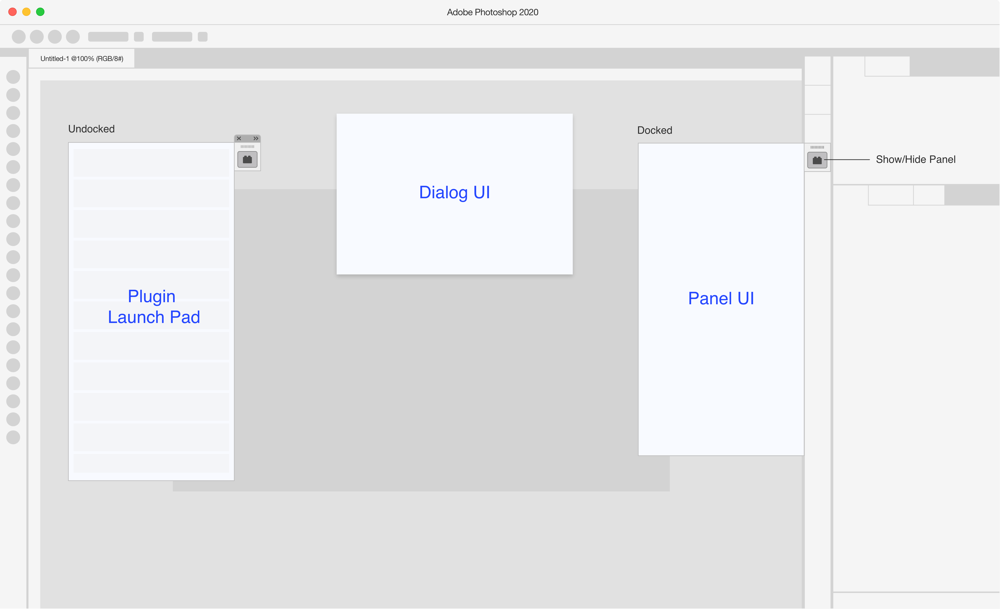
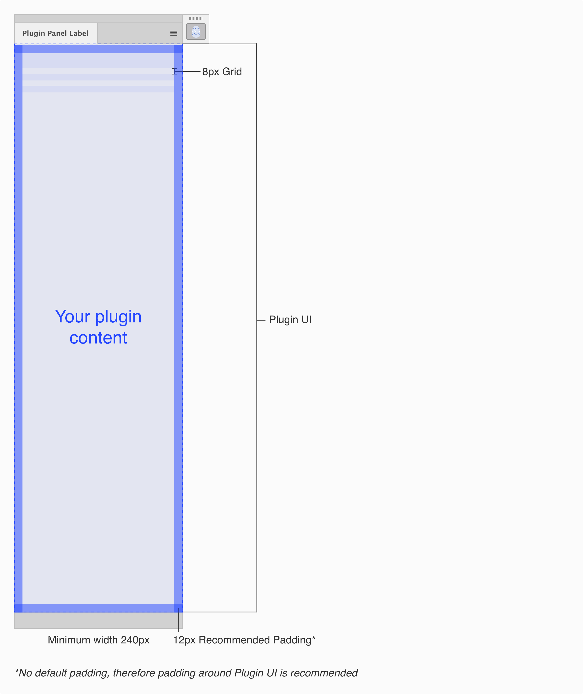
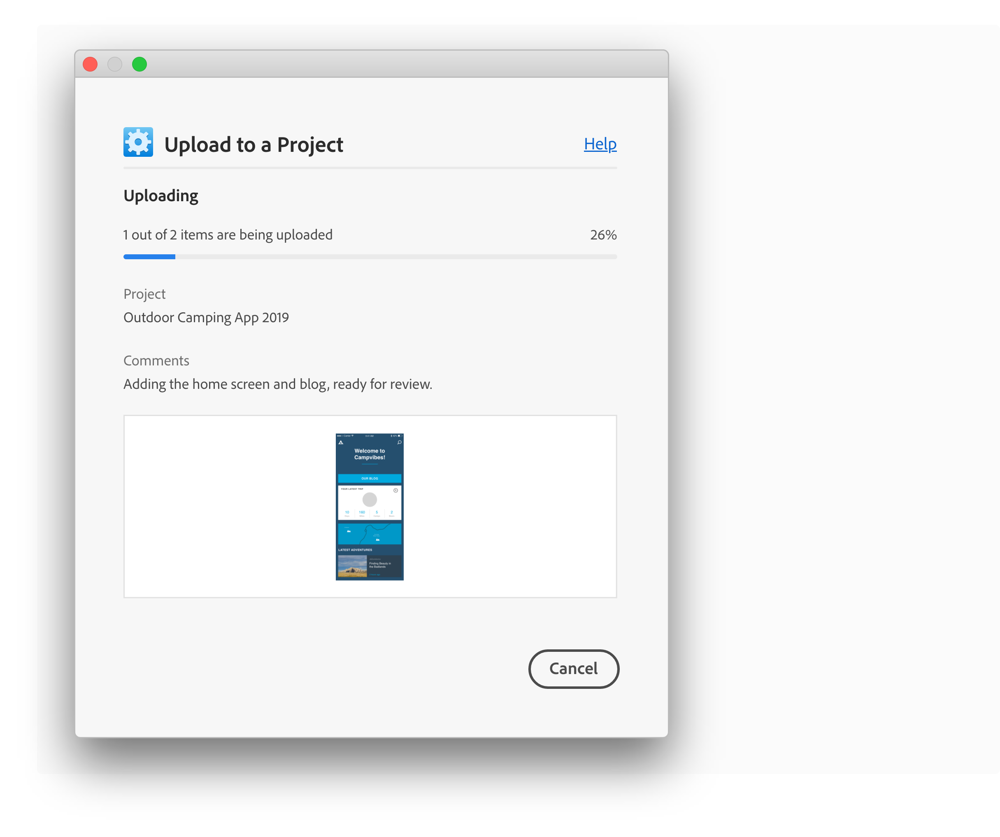
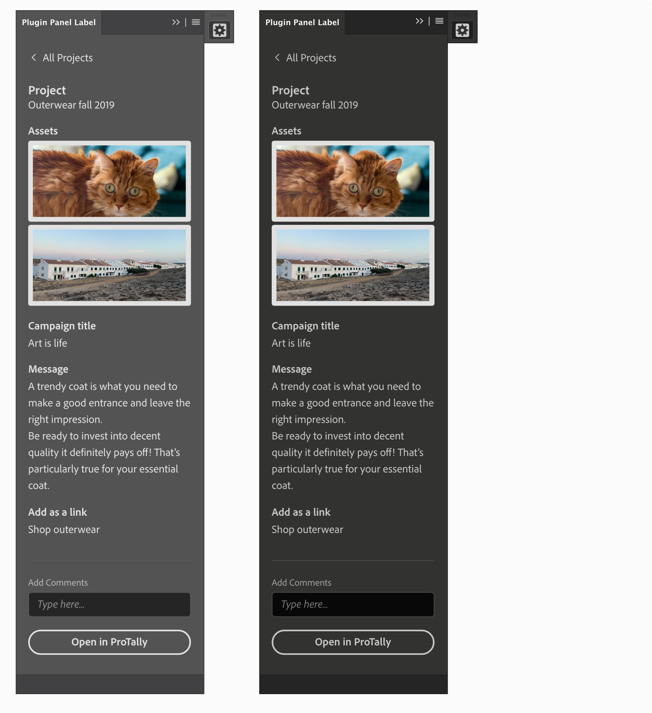
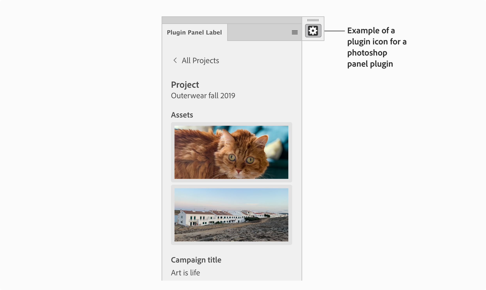
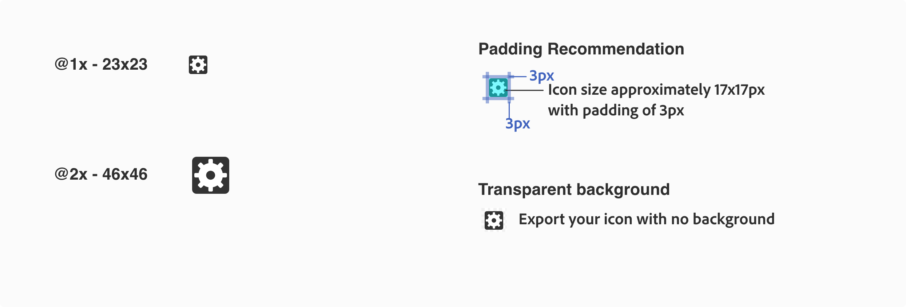
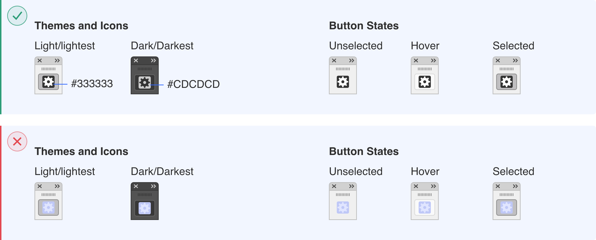

# Designing for Photoshop

This section will cover the different interfaces in Photoshop available to plugins. This includes specs, guidance around when and how to use the different interfaces and high level UX patterns that exist in Photoshop. 

<Resources slots="heading, links"/>

* [Overview](link)
* [Plugins Panel (non-blocking UI)](link)
* [Plugins Dialog (blocking UI)](link)
* [Themes and Icons](link)
* [UX Requirements](link)

----------
  

## Overview

There are two interface’s available to plugins in Photoshop, blocking UI (Dialog UI) and non-blocking UI (Panel UI).  The Plugin Launch Pad in Photoshop will let users view the list of their installed plugins and open a plugin right from their workspace. 

## Plugins Panel (non-blocking UI)

This section has recommendations when using a Plugins Panel - Non-Blocking UI in Photoshop. If the user needs to have access to the canvas, the plugin panel is the best option, since it’s contextual to the user’s selection and allows the user to modify items on their canvas while interacting with the plugin. 

**Panel UI - Specs**

MacOS example

Example

**Plugin Launch Pad**

Plugin launch pad and active submenu examples

## Plugins Dialog (blocking UI)

This section has recommendations when using a Plugins Dialog - Blocking UI in Photoshop. This interface is best used when the plugin needs to run an action and the user doesn’t need to modify or change selection of objects on the canvas.

For more guidance on “Dialog” best practices reference [Spectrum guidelines](spectrum.adobe.com/page/dialog)

**Panel UI - Specs**

Example

## Themes and Icons

Photoshop has different interface themes end-users can choose from. Consider the different themes when designing the plugin UI.[Spectrum guidelines](Link)support themes.

**Panel UI - Specs**

Lightest and Light Themes

Dark and Darkest Themes

**Photoshop Icon Guidelines**

This icon is shown when plugin is docked/undocked in the Photoshop application frame. There are a few things to consider when designing an icon for a panel plugin in Photoshop; the color of your icon and themes, icon size, padding and background.

[Download the plugin icon template](Link)

Since Photoshop uses themes, make sure there is enough contrast in the different Photoshop themes, or include at least light and dark versions of your icon. Here are some examples of monochromatic icons to support light and dark themes. Button states the icon will have a unselected, hover and selected states

