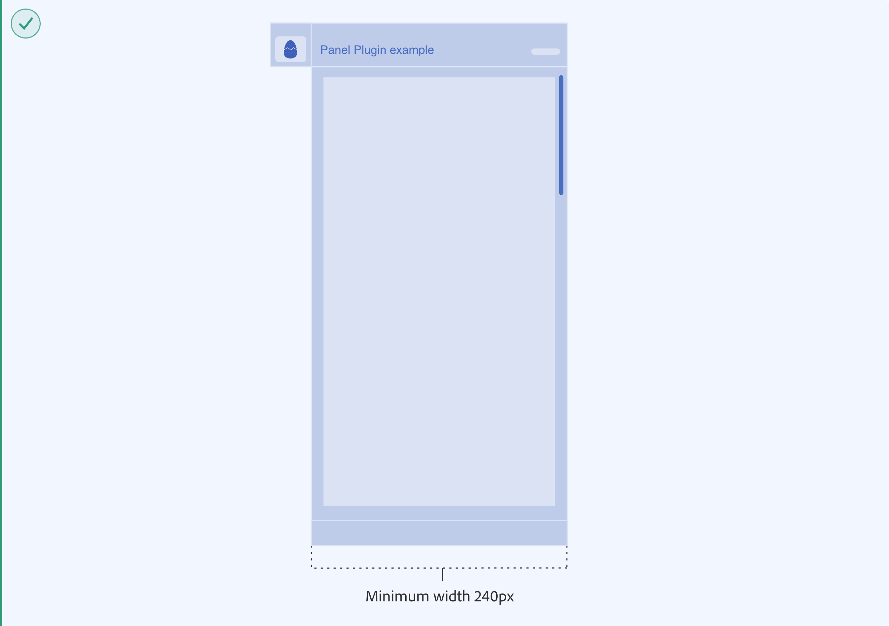
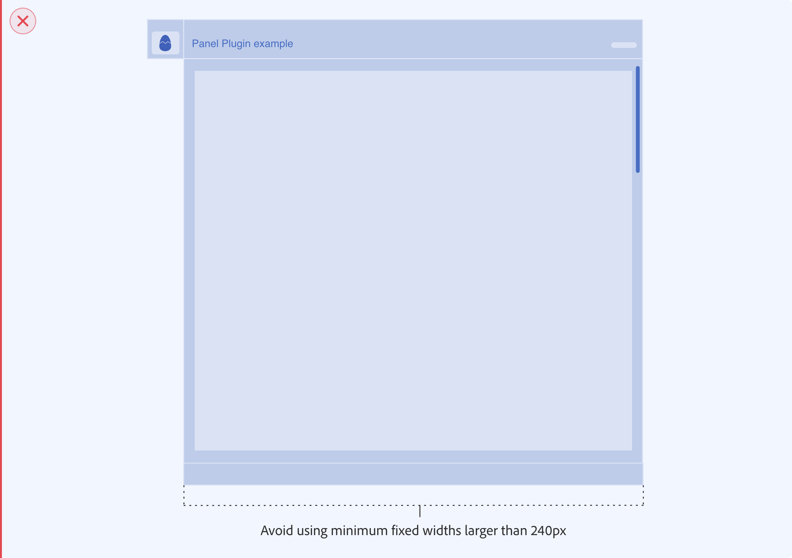
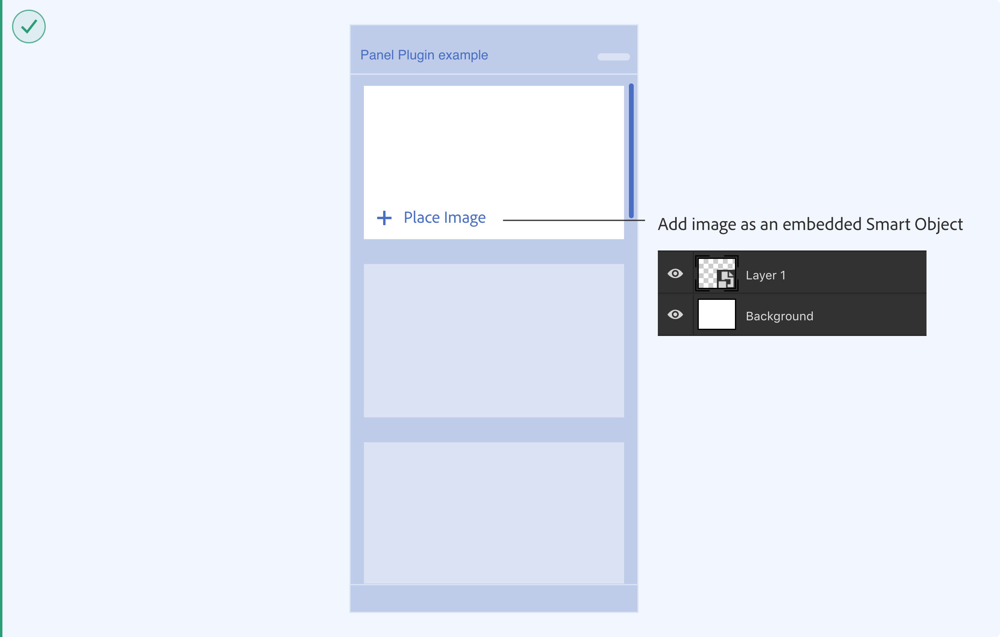
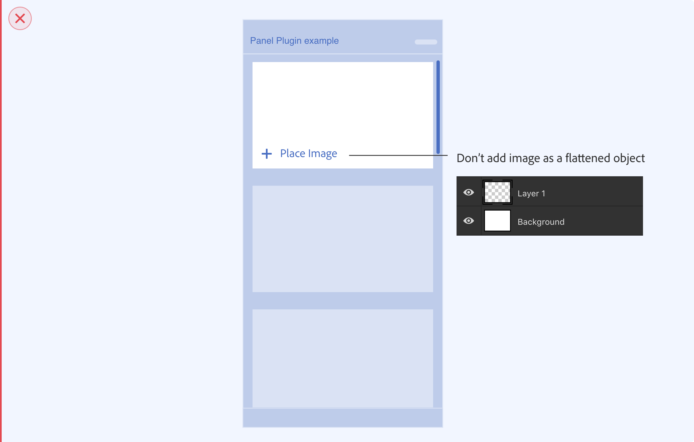
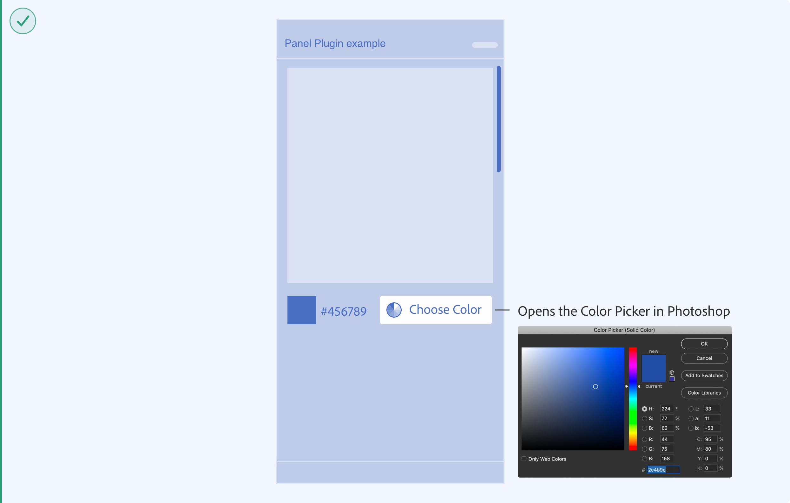
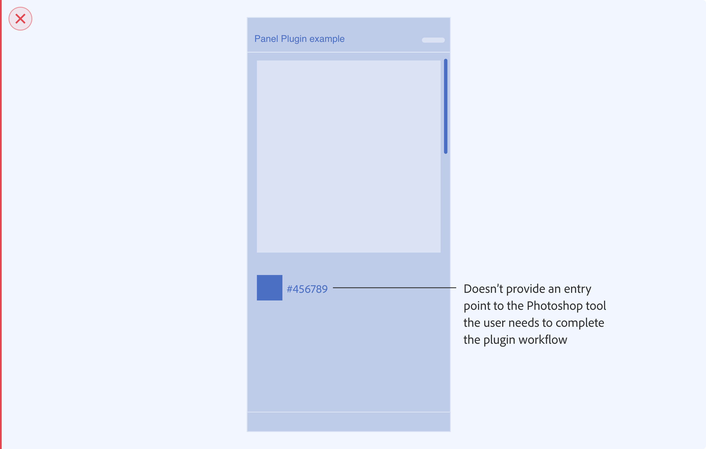

# Designing for Photoshop

This section will cover the different interfaces in Photoshop available to plugins. This includes specs, guidance around when and how to use the different interfaces and high level UX patterns that exist in Photoshop. 

 * Overview
 * Plugins Panel (non-blocking UI)
 * Plugins Dialog (blocking UI)
 * Themes and Icons
 * UX Best Practices

## Overview

There are two interfaces available to plugins in Photoshop: blocking UI (Dialog UI) and non-blocking UI (Panel UI).  The Plugin Launch Pad in Photoshop will let users view the list of their installed plugins and open a plugin right from their workspace. 

## Plugins Panel (non-blocking UI)

This section has recommendations when using a Plugins Panel - Non-Blocking UI in Photoshop. If the user needs to have access to the canvas, the plugin panel is the best option, since it’s contextual to the user’s selection and allows the user to modify items on their canvas while interacting with the plugin. 

**Panel UI - Specs**

MacOS example

Example

**Plugin Launch Pad**

In the Plugin Launch Pad your plugin icon and name will be shown in the list of other plugins the user has installed. If the plugin has a submenu with multiple commands then the submenu labels should let users know what the each command does. 

## Plugins Dialog (blocking UI)

This section has recommendations when using a Plugins Dialog - Blocking UI in Photoshop. This interface is best used when the plugin needs to run an action and the user doesn’t need to modify or change selection of objects on the canvas.

For more guidance on “Dialog” best practices reference [Spectrum guidelines](spectrum.adobe.com/page/dialog)

**Panel UI - Specs**

Example

## Themes and Icons

Photoshop has different interface themes users can choose from. Ensure your plugin supports the different themes when designing the plugin UI. The [UXP User Interface Spectrum Components](../user-interface/index/) support themes.

**Panel UI - Specs**

Lightest and Light Themes

Dark and Darkest Themes

**Photoshop Icon Guidelines**

This icon is shown when plugin is docked/undocked in the Photoshop application frame. There are a few things to consider when designing an icon for a panel plugin in Photoshop; the color of your icon and themes, icon size, padding and background.

Since Photoshop uses themes, make sure there is enough contrast in the different Photoshop themes, or include at least light and dark versions of your icon. Here are some examples of monochromatic icons to support light and dark themes. Button states the icon will have a unselected, hover and selected states

## UX Best Practices

**Avoid using minimum fixed widths larger than 240px**

Plugin panels in Photoshop can be docked within other panels. Having a fixed width larger than 240 px can create workspace issues for users. Allowing the user to resize the width and height of the plugin panel can create a better user experience for users interacting with your plugin within Photoshop.

**Placing image object into document**

It’s preferable to lead users towards a non-destructive path whenever possible. For example, if the plugin is adding a new image layer the recommendation is to place it as an embedded Smart Object. That way, the original pixels are protected and accessible even after the user makes edits to the layer.

**Contextual Actions and Photoshop Tools**

When the plugin needs a tool to be selected by the user to continue with the plugin workflow, provide contextual feedback on the plugin UI to let the user know or allow the user to open the photoshop tool from the plugin UI. For example if the user needs to change the color, provide them with an action to launch the photoshop Color Picker from the plugin UI.

