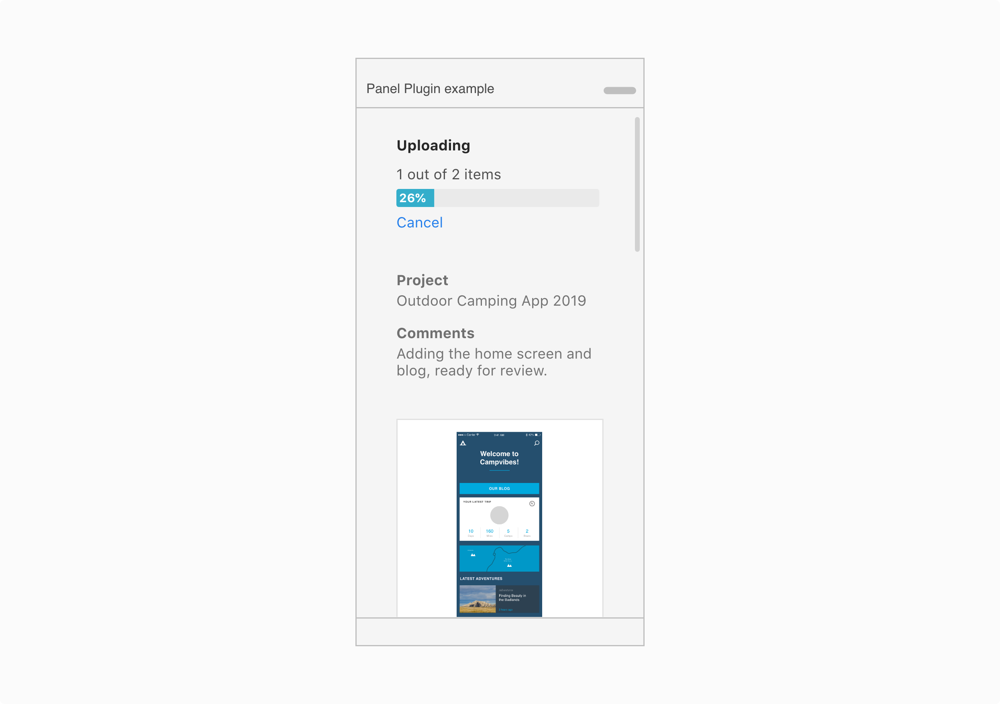

# Branding

To ensure users know they are interacting with your plugin, include branding throughout the plugin experience. Below are some examples.

 * [Onboarding and branding](Pagelink) 
 * [Customized plugin UI](Pagelink) 

 

## Onboarding and branding

When the user is interacting with the plugin for the first time for example in the onboarding or login screen, including the plugin logo will help the user identify the plugin in the future. 

 

## Customized plugin UI

Customizing the UI to include brand colors, will help users distinguish your plugin's interface. 

