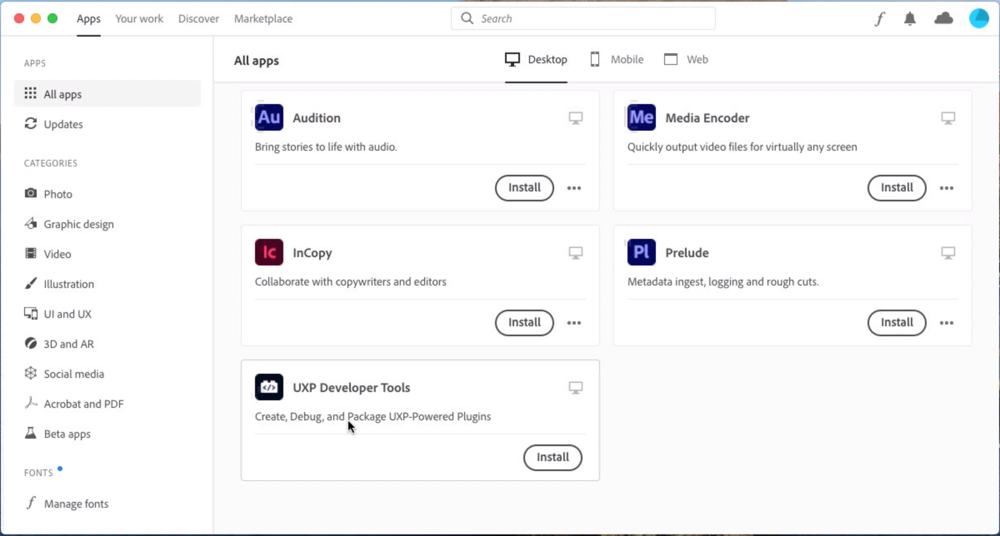
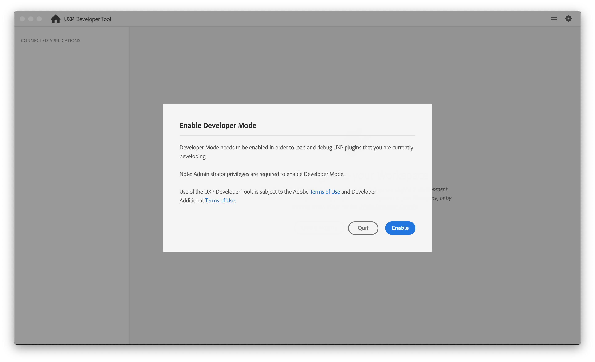

# Installation

You can install the UXP Developer Tools by clicking [here](https://creativecloud.adobe.com/apps/download/uxp-developer-tools) or by following these steps:

* Launch Adobe Creative Cloud Application. If not installed, Download and install Creative Cloud from [here](https://creativecloud.adobe.com/apps/download/creative-cloud).
* Sign in with your Adobe account if not already signed in.
* Click on `All apps` section, and you should see UXP Developer Tools listed.



* Click on the `Install` button for the `UXP Developer Tools` to start installation.

## Launching for the first time

When you launch the Developer Tool for the first time, you'll be prompted to enable Developer Mode. This is required in order for you to load plugins in development into Photoshop.



Once you click `Enable`, elevated permissions will be requested, and you may be required to enter your password or approve an action from the Developer Tool.


If you have problems with this step, you can also configure Developer Mode manually, although you must have Administrative privileges to do so:

* Quit the UXP Developer Tool
* Navigate to `/Library/Application Support/Adobe/UXP/Developer` on macOS, or `%CommonProgramFiles%/Adobe/UXP/Developer` on Windows. (If the folder does not exist, you can create it -- you'll need administrative rights.)
* Create a new file named `settings.json` with the following contents (You'll need administrative rights to save the file):
    ```json
    {"developer" : true}
    ```
* Launch the UXP Developer Tool again.


