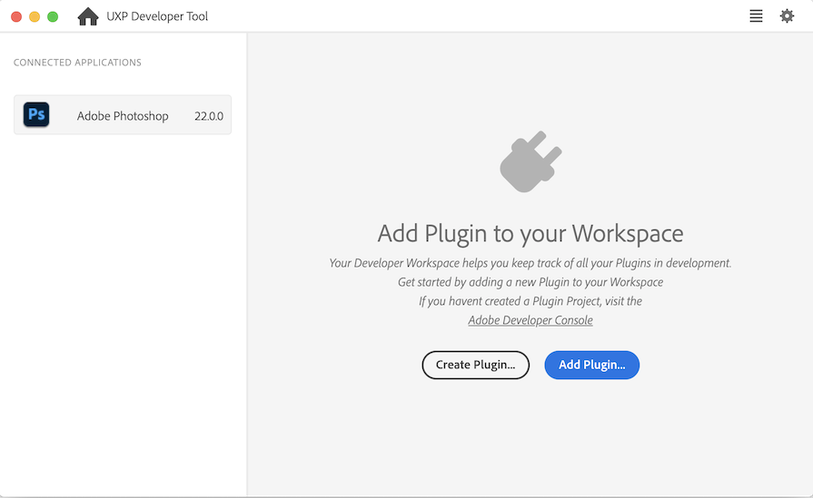
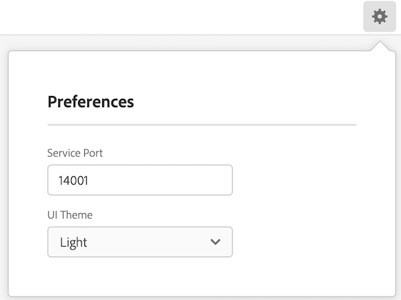
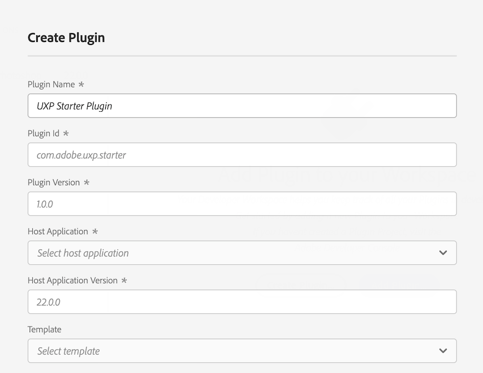
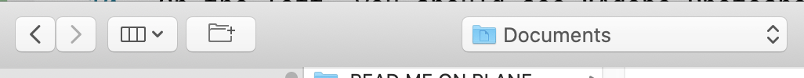
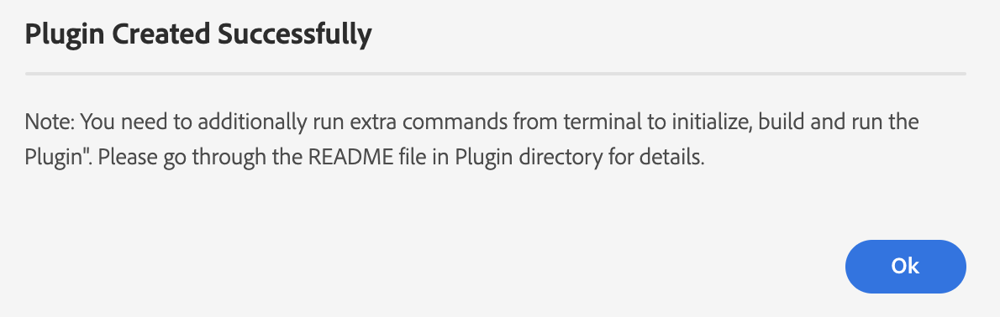
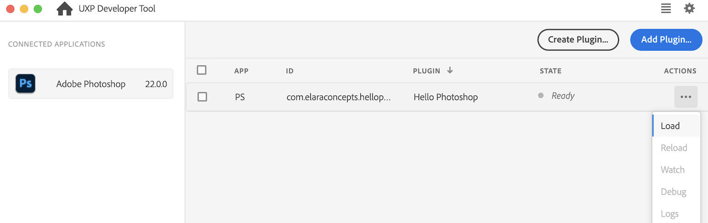
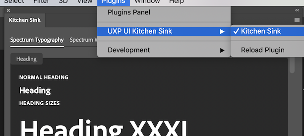

---
keywords:
  - Creative Cloud
  - API Documentation
  - UXP
  - Plugins
  - JavaScript
  - ExtendScript
  - SDK
  - C++
  - Scripting
title: UXP Developer Tool (UDT) Walkthrough guide
description: Learn how to navigate and use the UXP Developer Tool to create and debug your plugin.
---

# Creating a Plugin with the UXP Developer Tool

So you have Photoshop, you have the UXP Developer Tool, and you have Visual Studio Code or other programmer's text editor. Now what?

First make sure you have the UXP Developer Tool (UDT). Learn about installing UDT from [here](../devtool/installation). Then follow these steps:

1. Launch Photoshop.
2. Launch the UXP Developer Tool. If you've never launched it before, you should see a window like this:

You'll also see this window if you have no plugins loaded in the Tool.

The left pane shows applications that are "connected" to the tool. At this time, the only applications that can connect are Photoshop and XD. In this pane, you should see "Adobe Photoshop" in the `Connected Applications` list. If you don't, something is wrong; UDT can't connect to Photoshop. Make sure you're running at least version 22.0.0 of Photoshop; earlier versions did not support UXP.

The center pane shows the plugs that are loaded in UDT, but you don't have any yet. At the top right is a gear icon; if selected, it shows this sheet:

You shouldn't need to change the Service Port, which is what UDT uses to communicate with host applications. Feel free to change the theme.

3. Close that sheet, then click `Create Plugin`. You'll see this dialog:

4. Fill in the fields. The text in gray is cue text, _not_ a default value, so you need to fill in _all_ the fields. Give your plugin a unique name (i.e. don't call it "Layers") and plugin ID. Select "Adobe Photoshop" as the Host Application. Select "ps-starter" as the Template.

<InlineAlert variant="info" slots="text"/>

**IMPORTANT**:
When you distribute your plugin, you'll need to obtain a plugin ID from the [Adobe Developer Console](https://console.adobe.io/home). For testing, though, just invent an id like 'com.yourname.pluginname'.

For this exercise, we'll use the `ps-starter` template, which creates a very basic plugin using basic JavaScript with no libraries. Other choices in the `Template` popup include `ps-react-starter`, which creates a simple React-based plugin.

5. Click `Next`. UDT will prompt for a location in which to save the plugin files. Note that it _does not_ create a folder by default, so save your plugin into a previously-created empty folder, or click the `create folder` icon in the top left of the Save dialog:

6. The Developer Tool will save your plugin files, and you should then see this message:

> The message says you need run extra commands from the terminal. This is not true for simple JavaScript-only plugins, only for React-based ones.

7. Now, load your new plugin by clicking the `•••` (aka "Actions") menu (next to the name of the plugin you just created), and select `Load`.

 You should see a message like this at the bottom of the UDT window:
 
 

 Now take a look at Photoshop; your new plugin panel should be running!

 If it didn't load, you'll see an error popup like this:

 Clicking the `Details` link in this message will show an error log indicating why the plugin failed to load:

 

 ## Now What?

 Customize your plugin by editing the .js and .html files, perhaps adding some CSS. Make it your own! Don't forget to edit the `README.md` file and, if necessary, the `manifest.json` file.

In case you've closed your plugin's panel in Photoshop, you can find it again in Photoshop's `Plugin` menu:

 

 ## Watching, Reloading, and Debugging

 Selecting the `Watch` item from the Actions menu causes the Developer Tool to watch for any changes in your code on disk. 
 Whenever you make a change to a file in your project, UDT will reload your plugin automatically. This makes for a very rapid code->make mistakes->fix mistakes->reload cycle.

 You can also reload your plugin manually by selecting `Reload` from the Actions menu. If you have `Watch` enabled, you shouldn't have to do this. But some people are superstitious.

 You can also debug your plugin by choosing `Debug` from the Actions menu. This brings up a window like this:

 

 In this debugger (which resembles the Chrome debugger) you can look at the console log, and do the usual debugger things such as setting breakpoints, stepping into and out of functions, etc. If you just want to look at logs without dealing with the debugger, you can choose the `Logs` option in the Actions menu.

 ## Multiple Plugins

 You can host as many plugins as you want in the UXP Developer Tool. You can either create the plugin folder structure and files from scratch and click the blue `Add Plugin` button in the Tool, or you can click the `Create Plugin` button to have it created for you, wizard-style. Then you choose the `Load` item in the Actions menu to load your plugin into Photoshop.

 ## Packaging
 In order to distribute your plugin (after it's been throughly polished and debugged), you'll need to package it as a "ccx" file. This is easily accomplished by choosing the `Package` option in the Actions menu. Make sure you get a plugin ID from the [Adobe Developer Console](https://console.adobe.io/home) website before packaging your plugin for distribution.

 To distribute your plugin, see [Sharing Your Plugin](../../distribution/).