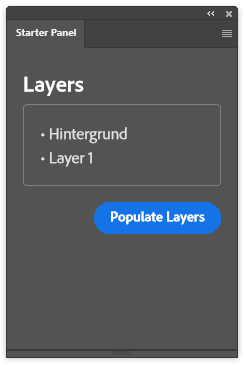
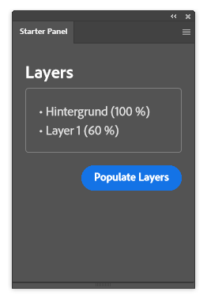
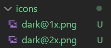

# Creating your first UXP-based Photoshop plugin

In this tutorial, you will create your first own Photoshop plugin using UXP.

## Prerequisites

To follow this tutorial, you need **Photoshop v23 or above** and the **UXP Developer Tool (UDT)**. You can
install both applications with the Creative Cloud Desktop app. You also need **basic knowledge of HTML and JavaScript**.

## Step 1: Create the plugin

Open the UXP Developer Tool and click the _"Create plugin..."_ button. In the dialog that opens, enter the following
details:

| Field                    | Value                |
| ------------------------ | -------------------- |
| Plugin Name              | My first plugin      |
| Plugin Id                | my.first.plugin      |
| Plugin Version           | 1.0.0                |
| Host Application         | Adobe Photoshop      |
| Host Application Version | 23.0.0               |
| Template                 | quick-layers-starter |

Click _"Select Folder"_ and select a new, empty folder where you want to develop your plugin. The Developer Tool creates
the necessary files in your selected folder and adds the plugin to the list of plugins.

You should now be able to see the following files in your selected folder:

- `icons`: a folder containing a set of icons for your plugin
- `index.html`: your plugin's entrypoint. This gets loaded when the plugin loads
- `manifest.json`: a file containing the metadata you specified in UDT as well as a pointer to the `index.html` as an
  entrypoint.

As well as some other "meta" files like `LICENSE`, `README.md`, etc.

## Step 2: Run the plugin

Open Adobe Photoshop and create some sample file you can use with your plugin.

To run your plugin within Photoshop, click the _"•••"_ button on the right of your plugin's row within the UDT and select _"
Load"_. This loads your plugin in Photoshop and automatically opens the plugin's panel.

The _quick-layers-starter_ template initially contains a panel with a _"Populate Layers"_ button that allows you to populate a box
within the panel with the layer names:



Let's take a look at what's going on in the background when running this plugin.

In the `manifest.json` file, the `"main"` field points to the `index.html` file:

```json
{
  "id": "my.first.plugin",
  "name": "My first plugin",
  "version": "1.0.0",
  "main": "index.html",
  "host": [
    /* ... */
  ],
  "manifestVersion": 4,
  "entrypoints": [
    {
      "type": "panel",
      "id": "vanilla",
      // [...]
      "icons": [
        // [...]
      ],
      "label": {
        "default": "Starter Panel"
      }
    }
  ],
  "icons": [
    // [...]
  ]
}
```

When Photoshop loads the plugin, it loads the `index.html` file specified here. The `index.html` file, in turn, defines
our panel's UI:

```html
<!DOCTYPE html>
<html>
  <head>
    <script src="index.js"></script>
  </head>
  <style>
    /* [...] */
  </style>
  <body>
    <sp-heading>Layers</sp-heading>
    <sp-body id="layers"> No layers </sp-body>
    <footer>
      <sp-button id="btnPopulate">Populate Layers</sp-button>
    </footer>
  </body>
</html>
```

As you can see, the `index.html` file then loads the `index.js`.

<InlineAlert variant="info" slots="text"></InlineAlert>

Note that while this looks like fairly standard HTML, the UXP environment is not a browser and only supports a [subset of HTML/CSS/JS features](/src/pages/uxp/reference-html/General/Unsupported%20Elements.md). You can also see some custom components like `<sp-heading>`, `<sp-body>`, and `<sp-button>`. These are so-called [Spectrum UXP components](/src/pages/uxp/reference-spectrum/index.md) that implement the Spectrum Design system and allow plugins to feel native in the surrounding Photoshop environment.

The `index.js` file then sets up a `click` listener on the _"Populate
Layers"_ button and uses the [Photoshop API](https://developer.adobe.com/photoshop/uxp/2022/ps_reference/) to populate the `<sp-body id="layers" />` element with the layer names:

```js
function showLayerNames() {
  const app = window.require("photoshop").app;
  const allLayers = app.activeDocument.layers;
  const allLayerNames = allLayers.map((layer) => layer.name);
  const sortedNames = allLayerNames.sort((a, b) =>
    a < b ? -1 : a > b ? 1 : 0
  );
  document.getElementById("layers").innerHTML = `
      <ul>${sortedNames.map((name) => `<li>${name}</li>`).join("")}</ul>`;
}

document
  .getElementById("btnPopulate")
  .addEventListener("click", showLayerNames);
```

Note that you can use the `window.require()` function to import various API modules, like `require('photoshop')` in this
example.

## Step 3: Adjust the plugin

_We could call this good enough, but let's face it: This doesn't feel like you've built your own
plugin. So let us at least add some customization to it by adding additional information about our layer to the output._

Have a look at the [`Layer` class API Reference](/src/pages/ps_reference/classes/layer.md). This page lists all the
properties and functions available on a layer object. You can choose whatever property you want, but for this tutorial,
we will just use the [`opacity: number` property](/src/pages/ps_reference/classes/layer.md#properties).

Adjust the `main.js` to also include the new property in the output:

```js
function showLayerNames() {
  // [...]
  const allLayerNames = allLayers.map(
    (layer) => `${layer.name} (${layer.opacity} %)`
  );
  // [...]
}

// [...]
```

With your `main.js` file saved, you need to reload the plugin to run the plugin including your changes. You can do this
by selecting the _"••• > Reload"_ option in the UXP Developer Tool.

<InlineAlert variant="warning" slots="text"></InlineAlert>

If you change anything in the `manifest.json` file, you need to do a full reload of the plugin to reflect the changes.
To do this, first select _"Unload"_ and then _"Load"_ in the UXP Developer Tool.

Alternatively, you can also watch your plugin folder for changes to reload the plugin automatically whenever you change
something. To do so, run the _"Watch"_ option in your plugin actions menu in the UDT.

Back in Photoshop, when you click _"Populate Layers"_ again, you should see that your property is now also included in
the output:



Also, you may find the icon missing when docking the plugin panel in a toolbar. It can be resolved by changing `"path"` field to the updated icon filename in `manifest.json`. For example, `"path": "icons/dark.png",` corresponds to following icon files



## Next steps

You've now built your first own plugin. It doesn't look like much right now, but by taking a look at what's available in the [API Reference](/src/pages/ps_reference/index.md), you can already do a lot of things with the knowledge of this tutorial, alone.

[In the next tutorial](../editing-the-document/index.md), you'll learn how you can not only get information about your document, but actually make changes to it, as well.
