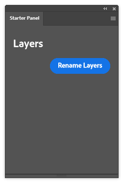
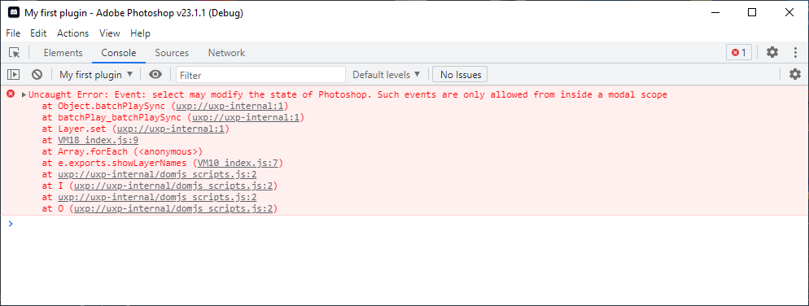
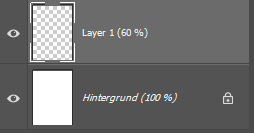
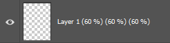

# Editing the document

In this tutorial, you'll learn how to edit your document (more specifically, edit the layer names within your document).

## Prerequisites

To follow this tutorial, you need to have a plugin development project ready to go. If you don't have a plugin
development project, yet, please first follow
the [Creating your first plugin tutorial](../creating-your-first-plugin/index.md).

## Step 1: Adjust the panel UI

Since the plugin no longer needs to show the layer names in its UI, we can remove some elements from the `index.html` file.

Remove the `<sp-body id="layers" />` element, its associated styles, and rename the _"Populate Layers"_ button to _"Rename Layers"_:

```html
<!DOCTYPE html>
<html>
  <head>
    <script src="index.js"></script>
  </head>
  <style>
    body {
      color: white;
      padding: 0 16px;
    }
  </style>
  <body>
    <sp-heading>Layers</sp-heading>
    <footer>
      <sp-button id="btnRename">Rename Layers</sp-button>
    </footer>
  </body>
</html>
```

Note that we also changed the button's `id` to `"btnRename"`. With that (after re-loading, in case you don't have UDT's _"Watch"_ function enabled), your panel should look like this:



## Step 2: Adjust the `index.js`

Next, you need to adjust the `index.js` code to match the new functionality. You might have already tried (while tinkering around) to just use something like this:

```js
layer.name = `${layer.name} (${layer.opacity} %)`;
```

While that's already close, you will run into an error stating that "Such events are only allowed from inside the modal scope":



<InlineAlert variant="info" slots="text" />

To open a Chrome Developer Tools window for your plugin, select _"Debug"_ in the plugin actions menu in the UXP
Developer Tool.

To get this to work, you need to wrap your code in a `window.require('photoshop').core.executeAsModal(targetFunction, options)` call. This creates a context in which your plugin has exclusive access to manipulating the document and thus ensures that no changes can be made to the document while your code executes (which could result in strange errors). You need to use `executeAsModal` for any operation that could edit the document. [Learn more about modal execution](/src/pages/ps_reference/media/executeasmodal.md).

Adjust your `index.js` code to look like this:

```js
function renameLayerNames() {
  return window.require("photoshop").core.executeAsModal(
    () => {
      // now, we have write-access

      const app = window.require("photoshop").app;

      app.activeDocument.layers.forEach((layer) => {
        layer.name = `${layer.name} (${layer.opacity} %)`;
      });
    },
    {
      commandName: "Rename layers",
    }
  );
}

document
  .getElementById("btnRename")
  .addEventListener("click", renameLayerNames);
```

When you reload your plugin using the UDT and press the new button, you can see that the layer names get adjusted accordingly:



## Step 3: Solve problem with consecutive executions

If you already have some development experience (or pressed the _"Rename Layers"_ buttons more than one time), you might already see a problem with our implementation. While the button works perfectly for the first time, every other time, it adds another percentage to the layer name:



To fix this, change your layer loop to the following:

```js
// [...]
app.activeDocument.layers.forEach((layer) => {
  const baseName = layer.name.match(/^(.*?)( \(\d+ %\))?$/)[1];
  layer.name = `${baseName} (${layer.opacity} %)`;
});
// [...]
```

This extracts the `baseName`, i.e., the layer name without an optional percentage after it, and always uses this as the base for the new layer name.

## Next steps

You now know how to use the Photoshop APIs to both read and write your document. As a rule of thumb, calling methods and setting properties that are declared as "Read-write" in the [Photoshop API Reference](/src/pages/ps_reference/index.md) requires a modal execution context.

[In the next tutorial](../writing-a-file/index.md), you will learn how to use the UXP APIs to interact with the file system and create a `.tsv` file with a list of your layers.
