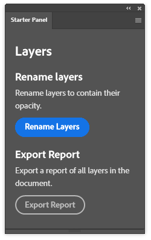
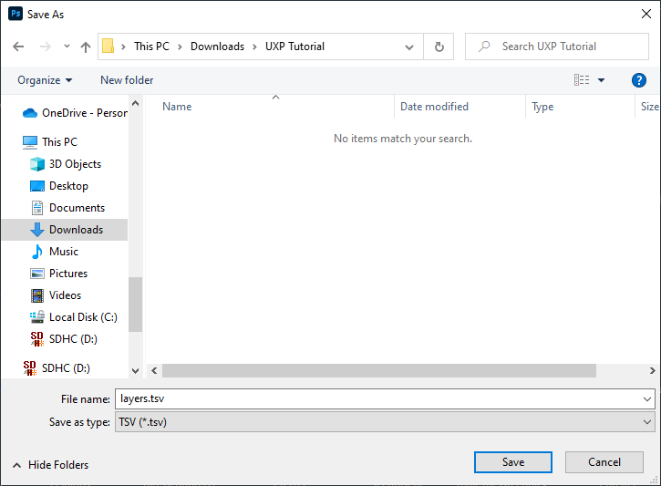
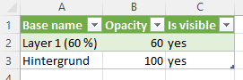

# Writing a file with UXP

In this tutorial, you will enhance your plugin by adding a button to export a `.tsv` file that lists all your document's
layers including some details.

## Prerequisites

This tutorial builds on top of the plugin from [the previous tutorial](../editing-the-document/index.md).

## Step 1: Adjust the `index.html`

In this tutorial, we want to add a new function to the plugin: Exporting a `.tsv` file.

To support this in your UI, adjust your `index.html` file to include another section with another button `<sp-button id="btnExport" />`:

```html
<!DOCTYPE html>
<html>
  <head>
    <script src="index.js"></script>
  </head>
  <style>
    body {
      color: white;
      padding: 0 16px;
    }
  </style>
  <body>
    <sp-heading>Layers</sp-heading>
    <sp-heading size="S">Rename layers</sp-heading>
    <sp-body size="S"> Rename layers to contain their opacity. </sp-body>
    <sp-button id="btnRename">Rename Layers</sp-button>
    <sp-heading size="S">Export Report</sp-heading>
    <sp-body size="S"> Export a report of all layers in the document. </sp-body>
    <sp-button id="btnExport" variant="secondary">Export Report</sp-button>
  </body>
</html>
```

The resulting panel looks like this:



## Step 2: Add the new function to the `index.js`

To export the file, you need to do two things:

1. create a string with the desired content of the file. This works the same as in the previous tutorials using the DOM APIs from the `window.require('photoshop')` module.
2. Use the UXP APIs, which you can access using `window.require('uxp')`, to ask the user for a location to save the file and save a file with the desired content to that location.

Add the following code to your existing `index.js` file:

```js
// [...]

async function exportReport() {
    // create the TSV string
    let tsvString = "Base name\tOpacity\tIs visible";

    const app = window.require("photoshop").app;
    app.activeDocument.layers.forEach((layer) => {
        tsvString +=
            "\n" +
            layer.name +
            "\t" +
            layer.opacity +
            "\t" +
            (layer.visible ? "yes" : "no");
    });

    // save the string to the filesystem
    const storage = window.require("uxp").storage;
    const file = await storage.localFileSystem.getFileForSaving("layers.tsv");
    await file.write(tsvString);
}

document.getElementById("btnExport").addEventListener("click", exportReport);
```

Note the `async` and `await` keywords. We need them as the UXP storage APIs are asynchronous. We therefore need
to `await` their execution.

After reloading the plugin, you get presented with a file picker when clicking the _"Export Report"_ button:



Note that this uses the string passed into `getFileForSaving(defaultName)` as the default name and also derives the supported file type from it.

When you open the exported file in Excel, you can see the list of layers with their properties:



## Next steps

You now know how to use the APIs provided by UXP to interact with the file system. But UXP allows you to do a lot more: Performing network requests, saving preferences using `localStorage`, get operating system information, open external urls, and much more. We encourage you to take a look at [UXP's API Reference](/src/pages/uxp-api/reference-js/index.md) to get an overview of everything you can do.

To learn how to distribute your plugin, take a look at [Sharing Your Plugin](/src/pages/guides/distribution/index.md).
