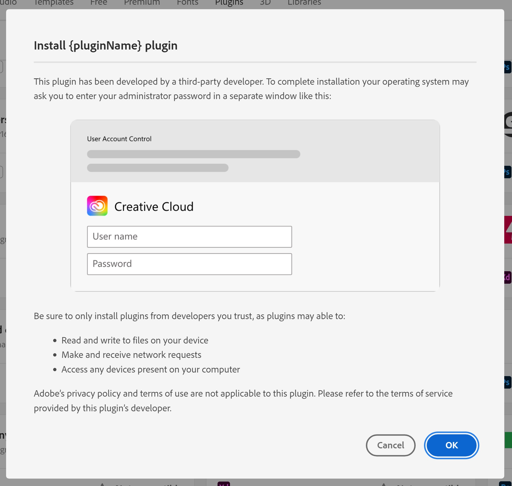

---
keywords:
  - UXP Hybrid distribute
  - Distribute
title: UXP Hybrid plugin - Distribute
description: Distribute a UXP Hybrid plugin
contributors:
  - https://github.com/padmkris123
---

# Distribute

Prepare your hybrid plugin to be listed in the Creative Cloud Marketplace via [Developer Distribution](https://developer.adobe.com/developer-distribution/creative-cloud/docs/guides/getting_started/) by following the [general packaging guidelines](../../distribution/packaging-your-plugin/).

Additionally, remember to:

1. Follow the instructions regarding the plugin structure from the SDK’s README
2. Sign and notarize the executables for macOS with a valid developer certificate from an Apple developer account. Self-signed/test certificates are not allowed.
3. Make sure the certificate is valid for at least one year.
4. Ensure the plugin works on all three architectures - Mac M1, Mac Intel, and Windows Intel. Find some tips in this [guide](../faqs/#how-can-i-prepare-the-binaries).

<InlineAlert variant="info" slots="text"/>

**Important note:** Since hybrid plugins have native capabilities, the users will be required to enter their OS admin credentials (as illustrated below) during plugin installation and update.

 
