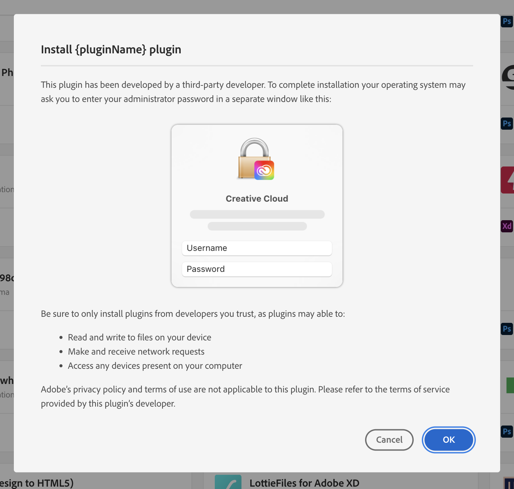
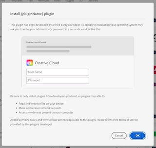

# Distribute

Prepare your hybrid plugin to be listed in the Adobe marketplace via [Developer Distribution](https://developer.adobe.com/distribute). To learn more about the platform and general packaging guidelines, visit [here](https://developer.adobe.com/developer-distribution/creative-cloud/docs/guides/getting_started/).

Additionally, remember to

1. Follow the instructions regarding the plugin structure in the SDK’s README
2. Sign and notarize the executables for macOS with a valid developer certificate from an Apple developer account. Self-signed/test certificates are not allowed.
3. Make sure the certificate is valid for at least one year.
4. Ensure the plugin works on all three architectures - Mac M1, Mac Intel, and Windows Intel. Find some tips [here](../faqs/#how-can-i-prepare-the-binaries).

<InlineAlert variant="info" slots="text"/>

**Important note:** Since hybrid plugins have native capabilities, the users will be required to enter their OS admin credentials (as illustrated below) during plugin installation and updates.

 