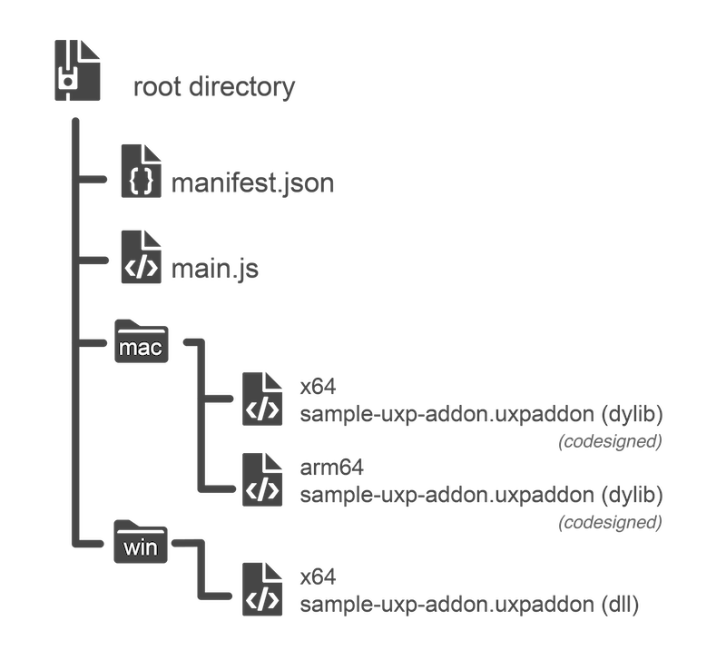

---
keywords:
  - UXP Hybrid
  - FAQs
title: UXP Hybrid plugin - FAQs
description: FAQs for UXP Hybrid plugin
contributors:
  - https://github.com/padmkris123
---

# FAQs

  

### How is the UXP SDK different from the Photoshop C++ SDK (aka CSDK)?

The two SDKs serve different purposes. The new UXP SDK lets you write any generic C++ code alongside JavaScript. The PS C++ SDK helps you extend Photoshop capabilities in seven areas including filters, file formats, and selections.

Before the introduction of UXP hybrid plugins, there were a few examples of third-party developers pairing a PS C++ plugin to a UXP plugin for UI. However, there are some challenges with that approach:

1. Such plug-ins require a custom installer that installs the two separate plugins on the user’s machine (one for UXP and the other for the C++ plug-in).
2. Communication between the two plugins is only possible in strings.

The hybrid plugin you build using the new UXP SDK will let you bundle C++ code and JavaScript in the same plugin package and provide you with more efficient options to communicate between the two worlds.

  

### Can I build a Photoshop filter (or other such capabilities) with the new Hybrid plugin SDK?

Yes, see the section under [Getting started](../getting-started/#photoshop-c-sdk).

  

### Do I need to code sign the entire plugin bundle?

No. You only need to sign (and notarize) the macOS executables with a valid Apple Developer certificate.

  

### Do I need an Apple Developer ID to sign/notarize the executables in hybrid plugins?

Yes. macOS only recognizes Developer ID-signed certificates (signed with your Apple Developer ID). Find the details in [Apple's guide](https://support.apple.com/guide/security/app-code-signing-process-sec3ad8e6e53/web).

  

### How can I prepare the binaries?

You need to prepare binaries for all three architectures: Mac M1, Mac Intel, and Windows Intel.

For the Operating System that is not available to you natively, you can use a virtual machine, such as VMware Fusion, to compile and test your plugin.

For creating binaries that work for both — Mac Intel and M1 architectures, refer to [Apple's guide for some tips](https://developer.apple.com/documentation/apple-silicon/building-a-universal-macos-binary) for some tips.