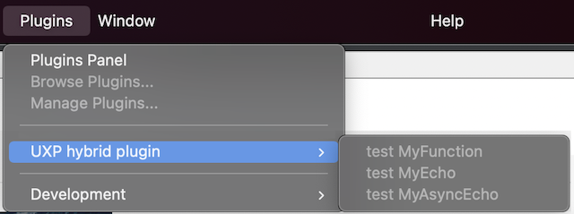

---
keywords:
  - UXP SDK
  - C++ SDK
  - Hybrid SDK
  - Hybrid samples
title: UXP Hybrid plugin - Getting started
description: Build a UXP Hybrid plugin using the UXP hybrid SDK 
contributors:
  - https://github.com/padmkris123
---

# Getting started

## Download the SDK

Begin by downloading the UXP Hybrid plugin SDK from [Developer Console](https://developer.adobe.com/console/servicesandapis/ps) (here is [what to do if you get “Access Denied”](https://developer.adobe.com/developer-distribution/creative-cloud/docs/guides/faq/#what-do-i-do-when-i-get-access-denied-upon-login)). Unpack the contents and make sure you check out the README.md. There are special instructions for building and packaging these plugins since they are different from a standard UXP plugin.

The concept of a hybrid plugin is very similar to Node.js C++ Addons. The dynamically linked shared objects written in C++ are available to JavaScript. `template-dev` walks you through a very basic example that illustrates how the two worlds communicate.

## Samples

Try the ready-to-use `template-plugin` provided within the SDK to say a quick ‘Hello world!’. Load the template via UDT and find it under the Plugins menu. 



<InlineAlert variant="info" slots="text"/>

The binaries in the `template-plugin` are not code signed. In macOS, please go to ‘Security & Privacy’ in your System Preferences to allow them to load and work properly.

## Debug

UXP Hybrid plugin has both - JavaScript and C++. Use the UDT Debug tool for setting breakpoints for JavaScript.

For debugging C++ code, you must attach to the `Photoshop.exe` process via the IDE. In most IDEs you can find that option under Debug -> Attach to Process.

However, in macOS you have to perform a prior step. Follow the guide to [debug in macOS](https://helpx.adobe.com/ca/photoshop/kb/debug-plugins-in-photoshop-bigsur.html).

## Known Issues

While loading your plugin via the UDT, it may not show your plugin in Photoshop automatically. Uncheck and check the plugin name from the ‘Plugin’ menu item to launch it. The fix for this is expected in a future macOS release.

## File system access

With the hybrid plugins, we have relaxed the UXP sandbox restrictions. You can access the file system in the following way:

```jsx
let entry = '/path/to/target.psd';
document.saveAs.psd(entry);
```

This is opposed to a standard UXP plugin’s method of accessing the file system:

```jsx
let entry = await require('uxp').storage.localFileSystem.getFileForSaving("target.psd");
document.saveAs.psd(entry);
```
