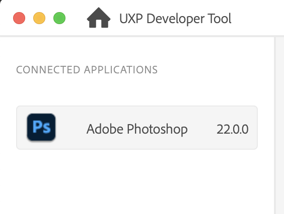
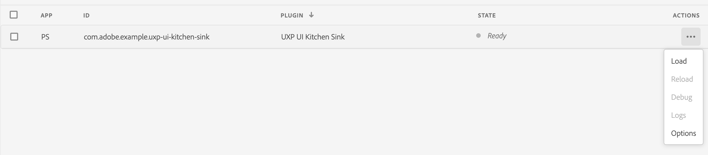
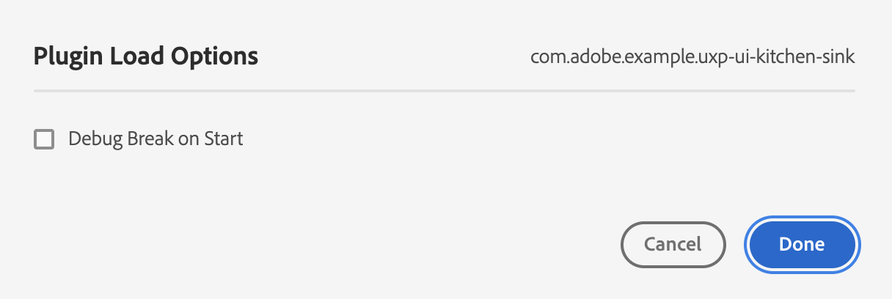

# UXP Developer Tool

The UXP Developer Tool (UDT) is a standalone GUI application that loads, unloads, and helps debug your UXP plugins. It is the easiest way to create the initial shell for a plugin as well as to submit the plugin for inclusion in the Marketplace.

## Installation
You can download installers for the UDT [here](#TBD). Once it's downloaded, run the installer just like any other one on Mac or Windows. On macOS, it creates a folder in your `Applications` folder named "Adobe UXP Developer Tool." On Windows, the folder is in the `Program Files->Adobe` folder.

## UDT User Interface
On first launch (and anytime there are no UXP plugins loaded) UDT displays this window:

The left pane shows applications that are "connected" to the tool. At this time, the only applications that can connect are Photoshop and XD. You should see something like this in the left pane:

If you don't see your application there, double check that it is indeed running and it's a version that supports UXP.

The center pane shows the plugs that are loaded in UDT. At the top right is a gear icon; if selected, it shows this sheet:

The `Service Port` is a WebSocket that UDT uses to communicate with the host applications; it should not be changed. The `UI Theme` can be set to Light or Dark (sorry, only two settings; this isn't Photoshop, after all).

Pressing the blue `Add Plugin...` button brings up a file selector dialog. Navigate to the `manifest.json` in your plugin folder and select it. Note that if you're creating a multi-app plugin that the manifest files may be different for different hosts (as is the current case with XD and Photoshop).
Once your plug is loaded, the Developer Tool window will look like this:

This means your plugin is registered with the Developer Tool, and its manifest has passed a minimal sanity check. If you see a message like this instead:

It means there's an error in your manifest file (often a missing JSON key). There's not much in the way of sanity checking in UDT yet, so you may successfully load a plug into the Tool but not be able to run it in the host application.

Your plugin is not yet active in the host application yet, however. To make it active, select `Load` under the Actions menu (the ellipsis at the far right). Then you should see this message:

And your plugin should be visible in the host application.

Once your plugin is running in the host application, you can debug it in a manner similar to the Chrome debugger. Choosing `Debug` from the Actions menu brings up a window like this:

Here you can look at the console output, set breakpoints, and examine source code.

If you just want to look at console output from the plugin, you can choose `Logs` from the Actions menu.

You can also reload the plugin (i.e., stop it running and start a fresh copy in the host application) by choosing the `Reload` option from the Actions menu.

Finally, if you'd like to set a breakpoint when the plugin loads, you can do that by choosing `Options` from the Actions menu. This shows a dialog like this:

## More to Come
As of this writing, the UXP Developer Tool is brand new. Expect more features to arrive over time. Also in the works is a command-line version of the Developer Tool, which is useful if you want to integrate it into your command-line build workflows.