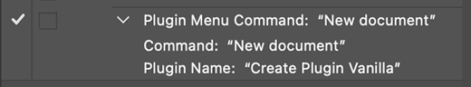

---
keywords:
  - Creative Cloud
  - API Documentation
  - UXP
  - Plugins
  - JavaScript
  - JSON
  - Manifest
  - Photoshop Manifest
  - Getting Started
  - Scripting
title: Photoshop Product specific manifest
description:
---

# Photoshop specific manifest properties

With Photoshop added as a "host" in the UXP plugin manifest, there are a few options available under the `data` object.
- apiVersion
- loadEvent
- enableMenuRecording

```json
{
    "manifestVersion": 4,
    "id": "YOUR_ID_HERE",
    "name": "Name of your plugin",
    "version": "1.0.0",
    "main": "index.html",
    "host": {
        "app": "PS",
        "minVersion": "23.0.0",
        "data" : {
          "apiVersion": 2,
          "loadEvent": "use",
          "enableMenuRecording": true
        },
    },
    "entrypoints": [
      {
        "type": "command",
        "id": "MENU_ITEM_ID",
        "label": { "default": "menu item's text"}
      }
    ]
}
```

## apiVersion
A limitation of the UXP implementation in Photoshop 2021 is that it does not provide a mechanism for plugins to run in isolation. Photoshop 2021 allows any plugin to modify Photoshop at any time. This includes scenarios when other plugins are active.

Photoshop 2022 has removed this limitation by introducing the modal JavaScript scope. Only one plugin can be inside a modal JavaScript scope at any time. See [executeAsModal](../../../../../ps_reference/media/executeasmodal/) for details.

The modal scope feature is not compatible with the original implementation because it imposes restrictions on when plugins may modify Photoshop.
It is these restrictions that guarantee against multiple plugins modifying Photoshop at the same time.

In order to allow plugin developers to gradually move to the new model, Photoshop 2022 supports both the original and the new JavaScript modes. A plugin uses the apiVersion field to specify which model it uses.
* `apiVersion` of **1** signifies that the plugin is using the original Photoshop 2021 implementation.
* `apiVersion` of **2** signifies that the plugin is using the new modal JavaScript paradigm.

With the introduction of apiVersion = 2, the original implementation is formally deprecated, and support for apiVersion 1 will be removed in a future major update to Photoshop. As such a number of new features are only available for apiVersion 2 plugins. apiVersion 2 only features include: new DOM v2, support for suspend and resume of multiple history states at the same time.

### Default value

The apiVersion field is optional. Its default value depends on the version of Photoshop that a plugin is targeting:
* A plugin whose minimum version is less than 23.0.0, will be assigned an apiVersion of 1 unless the plugin specifies otherwise in its manifest.
* A plugin whose minimum version is 23.0.0, or greater, will be assigned an apiVersion of 2 unless the plugin specifies otherwise in its manifest.

### Why use version 1 (2021)?

At this point, we expect almost all plugins to be able to use apiVersion 2. There were some early limitations that we believe are now addressed by executeAsModal's interactive mode. 

## loadEvent

> `Available in Photoshop 23.1 and later`

Plugins use memory and CPU resources when loaded. In order to minimize the impact on general Photoshop performance, plugins are by default loaded only when needed. The default mechanism will load a plugin when its panel UI becomes visible, or when the user chooses to execute a plugin command from the `Plugins` menu.

Certain use cases require that a plugin is loaded when Photoshop is launched. Such use cases include plugins that listen and respond to user actions, and plugins that needs to communicate with a remote server or process when Photoshop is running.

The loadEvent field allows a plugin to specify when it is loaded. The possible values are:
* `use`: The plugin is loaded when needed (when its UI become visible, or when a plugin command is executed). This is the default value.
* `startup`: The plugin is loaded automatically shortly after Photoshop is launched.


## enableMenuRecording

[Menu items](../index.md#entry-points) (`type: "command"`) defined in the manifest's `entrypoints` will appear under that plugin's submenu under the top-level Plugins menu. Those menu items can be recorded as Action steps by setting `enableMenuRecording` to `true`.  Once set, those menu items will appear in a recorded Action as "Plugin Menu Command" along with the label of the menu item.

