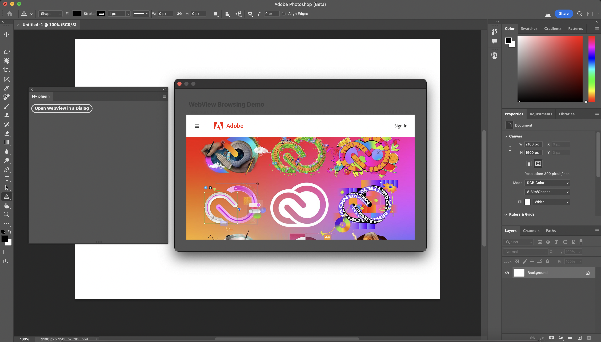

---
keywords:
  - Creative Cloud
  - API Documentation
  - UXP
  - Plugins
  - JavaScript
  - JSON
  - Manifest
  - Scripting
title: Manifest v5
description:
---

# UXP Manifest v5

Manifest v5 gives developers access to a new plugin permissions model and WebViews in modal dialogs.

Upgrade your plugin to use the latest manifest feature set by changing the `manifestVersion` element. 
```json
"manifestVersion": 5
```
## Example manifest
```json
{
    "manifestVersion": 5,
    "id": "YOUR_ID_HERE",
    "name": "Name of your plugin",
    "version": "1.0.0",
    "main": "index.html",
    "host": {
        "app": "PS",
        "minVersion": "23.0.0"
    },
    "entrypoints": [
        {
            "type": "command",
            "id": "commandFn",
            "label": {
                "default": "Show A Dialog"
            }
        },
        {
            "type": "panel",
            "id": "panelName",
            "label": {
                "default": "Panel Name"
            },
            "minimumSize": {"width": 230, "height": 200},
            "maximumSize": {"width": 2000, "height": 2000},
            "preferredDockedSize": {"width": 230, "height": 300},
            "preferredFloatingSize": {"width": 230, "height": 300},
            "icons": [
                {"width":23,"height":23,"path":"icons/dark.png","scale":[1,2],"theme":["darkest","dark","medium"]},
                {"width":23,"height":23,"path":"icons/light.png","scale":[1,2],"theme":["lightest","light"]}
            ]
        }
    ],
    "icons": [
        { "width": 23, "height": 23, "path": "icons/icon_D.png", "scale": [ 1, 2 ], "theme": [ "dark", "darkest" ], "species": [ "generic" ] },
        { "width": 23, "height": 23, "path": "icons/icon_N.png", "scale": [ 1, 2 ], "theme": [ "lightest", "light" ], "species": [ "generic" ] }
    ],
    "featureFlags": {
        "enableExperimentalWebviewSupport" : true
    },
    "requiredPermissions": {
        "network": {
            "domains": [
                "https://adobe.com",         
            ]
        },
        "clipboard": "readAndWrite",
        "webview": {
            "allow": "yes",
            // domains --> string[] | "all"
            "domains": [ "https://*.adobe.com", "https://*.google.com"],
            "allowLocalRendering": "yes"
        },
        "launchProcess": {           
            "schemes": 
                [ "https", "slack"],            
            "extensions": 
                [ ".xd", ".ps" ],        
        }, 
    },
}
```

## Changes to top-level metadata
Starting from changes to top-level metadata, here are some keys that changed with the v5 upgrade. Read [manifest v4](../manifest-v4/) to learn more about each key/value field.

Key path | Type | Description | Change 
---------|------|-------------|-------
`version` | string| Version number of your plugin in `x.y.z` format. | Plugins can specify semver format with no warnings. <br/>Specify at least one number and the minor and/or patch will be autofilled with zeroes.
`title` | string | Title for the plugin. <br/>Defaults to plugin's name if none is specified | New in v5.
`requiredPermissions` | object | Declare [plugin permissions](#plugin-permissions). | New in v5.
`entrypoints` | `EntryPointDefinition[]` | Describes the entries your plugin adds to the _Plugins_ menu and plugin panel. | v5 changes in next section.

## Changes to entry points
The changes to `entryPoints` add flexibility in specifying the initial view/location of plugin panels.

Key | Type | Description | Change
----|------|------------ |------
`id` | string | Unique identifier for the entry point. This `id` will also be mapped to entrypoints defined in your plugin code. | Passed as the id for the uxpcommand, uxpshowview (New V5) and  uxphideview (New V5) events.
`hostUIContext` | object | Use [this property](#hostuicontext) to customize how entrypoints appear. | New in v5.
`featureFlags` | object | Indicates feature flags in use. | `enableWebview` boolean flag. 

### HostUIContext 
By default, panels from the same plugin are grouped together by the host app. If more control is needed, developers can use this property.

Key | Type | Default | Description
----|------|------------|---
`hideFromMenu` | boolean | `false` | If `true`, the entrypoint is hidden from the plugins menu.
`hideFromPluginsPanel` | boolean | `false` | If `true`, the entrypoint is removed from the plugins panel (launchpad).
`initialLocation` | string | plugin ID | Plugins are grouped together upon ID by default. You can specify a new ID to group subsets of panels together. 
`triggerEvents` | string[] | -- | Specifies if the entrypoint should be triggered by host-determined events. 

## Plugin Permissions
Plugins using Manifest v5 will enjoy the enhancements in security with the introduction of new permissions model. Users will be asked for their consent when your plugin attempts to use openExternal, openPath, and sp-link/anchor tags. For everything else, consent is assumed given at install time.

Starting with v5, any permissions not explicitly declared in the manifest are by default not granted. 

### Network
You have to specify unlock the `network` module in `requiredPermissions` by defining domains from which network requests are allowed. `domains` accepts an array of strings or a singular string `"all"`.
```json
/* manifest.json */
{
    "requiredPermissions": {
        "network": {
            "domains": [
                "https://source.unsplash.com",         
            ]
        }
    }
}
```
```html

```
### Clipboard
To grant read and/or write access to the system clipboard, declare it in `requiredPermissions`.
`clipboard` accepts:
* `readAndWrite` for read/write access
* `read` for read-only access. 

```json
{
    "requiredPermissions": {
        "clipboard": "readAndWrite"
    }
}
```
 
```js
const clipboard = navigator.clipboard;
const dataTransferProviders = {
    'text/plain': 'Sample text'
};
clipboard.writeText(dataTransferProviders).then(
    (result) => {...},
    (error) => {...}
);
```

### Local Filesystem
`localFileSystem` accepts:
* `request`: Allows the plugin to access the local file system using token provided by UXP.
* `plugin`: Allows the plugin to access the plugin's sandbox, but doesn't enable file picker APIs.
  
```json
{
    "requiredPermissions": {
        "localFileSystem": "request"
    }
}
```
 
```js
const fs = require('uxp').storage.localFileSystem;
const file = await fs.getFileForSaving('manifest_demo.txt');
await file.write('Manifest v5 demo');
```
If `plugin` is not specified for plugin storage, the manifest will default to that setting.

### Launch Process
The `launchProcess` permission in the manifest controls the ability to launch applications and open files in other applications. 

Before manifest v5, `shell.openPath()` was enabled using the feature flag `kEnableShellOpenPath`. Additionally, `openExternal()` was only accessible with the following code block in manifest: 
```json
"permissions": {        
    "launchProcess": 
        "request" | "any"    
}
```

With manifest v5, the feature flag has been removed by v5 and the `launchProcess` permission must be declared to use `openExternal()` or `openPath()`. 
```json
"permissions": {        
    "launchProcess": {    
        // allows launching files with specified URI schemes         
        "schemes": 
            [ "https", "slack", "adbxd" ],   
        // allows opening files with the specified file extensions          
        "extensions": 
            [ ".pdf", ".xd", ".ps" ],        
    },   
}
```
Both openPath() and openExternal() rely on this permission set, and upon either function call, the user will get a runtime consent dialog. Only after they agree will the API call execute. 

### Plugin communication 
If enabled, the plugin can communicate with other installed plugins. Defaults to `false`.
```json
"permissions": {        
    "ipc": {
        "enablePluginCommunication": true   
    }
}
```
```js
const { pluginManager } = require("uxp");
// find the Alchemist plugin in the loaded plugins
const alchemistPlugin = Array.from(pluginManager.plugins).find(plugin => plugin.id==="2bcdb900");   
//What commands and panels are available?
const alchemistCommands = Array.from(alchemistPlugin.manifest.commands, command => command.commandId); // result: ["resetStateFn"]
const alchemistPanels = Array.from(alchemistPlugin.manifest.panels, command => command.panelId); // result: ["inspector"]     
// Show the inspector panel; note that panels can only be made visible -- you can't ask to hide the panel
alchemistPlugin.showPanel("inspector");
// Reset Alchemists state... but be sure you want to do this!
alchemistPlugin.invokeCommand("resetStateFn");
```

### Host Communication 
If enabled, the plugin can communicate with installed filters, automation plugins, etc. Defaults to `false`.
```json
"permissions": {        
    "ipc": {
        "enableHostCommunication": true   
    }
}
```

### Fonts 
This permission allows the plugin to access the fonts installed on the system. 
```json
"permissions": {        
    "fonts": "readInstalled" 
}
```

## WebViews
WebViews are available with UXP 6.0, and need to be configured in your plugin's manifest (v5 required).

### Limitations 
* Only available within modal dialogs for now.
* Only remote content is allowed unless `webview.allowLocalRendering` is set to yes.

In your `manifest.json`: 
```json
{
    "manifestVersion": 5,
    "featureFlags": {
        "enableExperimentalWebviewSupport" : true
    },
    "requiredPermissions": {
        "webview": {
            "allow": "yes",
            // domains --> string[] | "all"
            "domains": [ "https://*.adobe.com", "https://*.google.com"],
            "allowLocalRendering": "yes"
        }
    }
}
```
Then in your plugin's code: 
```html
<dialog>
    <webview id="webview" width="100%" height="360px" src="https://www.google.com"></webview>
</dialog>
```



