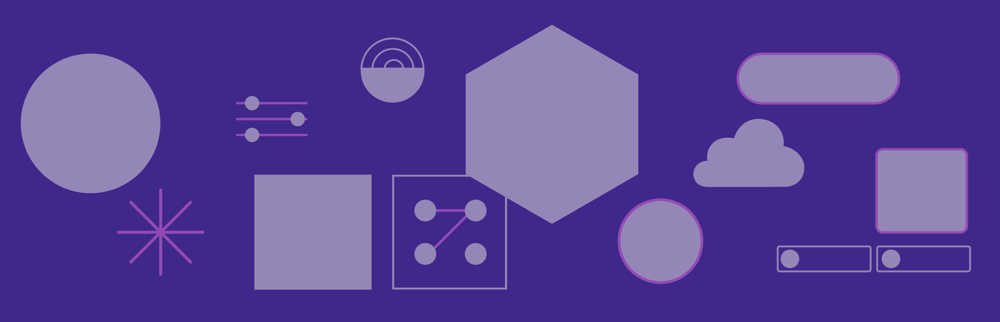

<Hero slots="image, heading, text" background="rgb(64, 34, 138)"/>

 

# UXP for Adobe Photoshop 

UXP (**U**nified E**x**tensibility **P**latform) is the modern technology stack in which to build plugins for Photoshop and other Adobe Creative Cloud applications. This is the place for developers to learn how to use UXP to build amazing Photoshop plugins.

<Resources slots="heading, links"/>

#### Resources

* [Quickstart Guide](guides/)
* [Photoshop API](ps_reference/)
* [UXP API](uxp/reference-js/)
* [Developer Forums](#)

## Overview

This documentation helps developers build plugins for Adobe Photoshop versions 22.0 and later. If you're building plugins for earlier versions of Photoshop, see the [CEP Getting Started Guides](https://github.com/Adobe-CEP/Getting-Started-guides).

UXP provides modern JavaScript, a curated selection of UI components, and a more streamlined workflow for plugin developers. With UXP, you can develop:

- Direct Actions - headless plugins that interface with Photoshop, the host OS, and the network, free of any UI.
- Modal Dialogs - plugins that implement one or more modal dialogs. Good for simple user interfaces that don't need to persist.
- Panels - full-featured panels that look like any other panel in Photoshop. UXP panels can contain as complex a UI as you wish to develop. They can be resized, docked, opened and closed just like native Photoshop panels. And with appropriate CSS constructs, your UXP panels can be theme-aware and change as the user switches UI themes in Photoshop.

<InlineAlert variant="info" slots="text"/>

**IMPORTANT**:
While this documentation set talks exclusively about Photoshop plugins created using UXP, earlier methods of controlling Photoshop, including CEP (Common Extensibility Platform) and ExtendScript continue to be supported. Over time these earlier technologies will be deprecated and then removed from Photoshop, but there is no need to rush to convert your existing plugins to UXP.

## Discover 

<DiscoverBlock width="100%" slots="heading, link, text"/>

### Get Started

[Getting Started Guide](guides/)
    
Get started with UXP for Adobe Photoshop.

<DiscoverBlock slots="heading, link, text"/> 

### Guides

[Photoshop UXP for You](guides/uxp_for_you/) 

What experience do you have with previous Photoshop plugin solutions? Here's what you'll need to learn based on what you already know.

<DiscoverBlock slots="link, text"/>

[Designing for Photoshop](/design)

Here are some key design principles for UXP plugins in Photoshop. Learn the high level UI/UX patterns, and understand the different kinds of UI your plugin can present.

<DiscoverBlock slots="link, text"/>

[Photoshop API Basics](guides/ps_basics/)

For UXP, Photoshop exposes a new API which differs from the one exposed for CEP and ExtendScript.   

<DiscoverBlock slots="link, text"/>

[UXP Developer Toolkit](guides/uxp-developer-tool/)

The UXP Developer Tool is a GUI app that helps you create, debug, and distribute plugins. It's an essential part of any UXP plugin workflow.

<DiscoverBlock slots="link, text"/>

[Sample Code](code_samples/)

Want to jump right in building a plugin? Check out these code samples and make immediate progress.

<DiscoverBlock slots="link, text"/>

[Packaging and Distribution](guides/distribution/)

Once you've built your plugin, how do you get it to market? The answer: the Creative Cloud Marketplace. Find out how you can prepare your plugin for distribution in the Marketplace.

<DiscoverBlock slots="heading, link, text"/> 

### API References

<DiscoverBlock slots="link, text"/>

[Photoshop API](ps_reference/)

The API Reference for Photoshop calls exposed to UXP.

<DiscoverBlock slots="link, text"/>

[UXP API](uxp/reference-js/)

The API Reference for UXP itself. Includes file and network I/O.

<DiscoverBlock width="100%" slots="heading, link, text"/>

## Share

You've built the world's greatest plugin. What do you do now? This section explains how to package, distribute, and market your plugin.

<DiscoverBlock slots="link, text"/>

### [Packaging Your Plugin](distribution/packaging-your-plugin/)

Packaging your UXP plugin is a breeze. In many cases, it's just one click away.

<DiscoverBlock slots="link, text"/>

### [Options for Distribution](distribution/distribution-options/)

Did you build a plugin just for yourself, for your friends, for your employer? Or did you want to distribute through the Creative Cloud on millions of desktops? Read this section to help you decide.

<DiscoverBlock slots="link, text"/>

### [Submission and Review](distribution/submission-checklist/)
Learn about the review process and associated timelines for Creative Cloud integrations, and follow our review submission checklist.

<DiscoverBlock slots="link, text"/>

### [Marketing Your Plugin](distribution/marketing/)

Submitting your plugin is only half the battle. Now you have to tell people about it. Read this for some ideas on how to best market your plugin.

## Contributing 

We encourage you to participate in our open documentation initiative, if you have suggestions, corrections, additions 
or deletions for this documentation, check out the source from [this github repo](https://github.com/AdobeDocs/uxp-photoshop), and submit a pull 
request with your contribution.