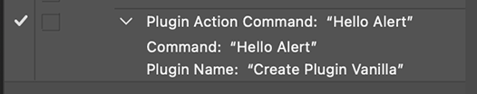

# Recording an Action Step Provided by a UXP Plugin

While recording an Action via the Photoshop Actions panel, a UXP plugin can add a step by using [`require('photoshop').action.recordAction`](./photoshopaction/#recordaction).  The recorded step will include a function name and an object holding provided data.  In this way, the Action step will execute the function with the data when played.

## recordAction

The following method from the Action module will add a step to the Action that is being recorded:

```javascript
const PhotoshopAction = require('photoshop').action;
PhotoshopAction.recordAction(
    {
        "name": "My Command",
        "methodName": "actionHandler"
    },
    {"prop": value}
);
```

Later when the recorded Action is invoked, the named top-level JavaScript function is invoked:

```javascript
async function actionHandler(executionContext, info) {
    let propValue = info["prop"];
}
```
The `executionContext` argument conforms to the argument used by [executeAsCommand](./executeasmodal).  There is no usage of the context related to Action recording at this time.


Example:
```javascript
// Start recording an Action, then execute the code below.
async function alertHandler(context, dataObj) {
    require('photoshop').core.showAlert(dataObj.message);
    return dataObj;
};
require('photoshop').action.recordAction(
    {
        "name": "Hello Alert",
        "methodName": "alertHandler"
    },
    {message: "Hello!"}
);
// Stop recording, and play the Action.
```


You can run the above in the UDT console of a loaded plugin or the Playground to try it. 
Note: `recordAction` is not compatible with Script execution (.psjs files), since there is not a plugin holding the function declaration in its environment.

### Signature

```typescript
async function recordAction(
    {
        name: string,
        methodName: string
    },
    info: Object ): Promise<void>
```

### Arguments

|argument|description|
|---|---|
|name|User visible string. Used by the Actions panel to display the name of the Action step.|
|methodName|Name of top level JavaScript function. This method is invoked when the recorded Action is executed from the Actions panel.|
|info|Object with data to be used by the above function. This is recorded with the Action and then provided to the target JavaScript function when the recorded Action is played. The properties in `info` will be shown in the Actions panel if the property name is a recognized property name. The list of recognized property names will change between Photoshop versions. The best way to see names of known properties is to find an Action with the desired name and then use `Copy As JavaScript` to inspect the corresponding identifier.  If you have internal properties that should not be shown, then you can add a unique prefix. For example your reverse url: `com.foo.myProperty`.|


### Additional Notes

The function (`methodName`) must must be declared at the `global` level to be called later at playback.
- async actionHandler(c, d) => {...
- async function actionHandler(c, d) {...
- actionHandler = (c, d) => {...
- var actionHandler = (c, d) => {...

Avoid due to scope:
- let actionHandler = (c, d) => {...

Also, keep in mind that only the **name** of the function is recorded in the Action step.  The function body remains in the environment of the plugin.  As such, the function declaration can change, for example, by way of an update to the plugin itself.  The Action step will still call it with the data object that was recorded in the step.  

An info argument is required.  If your function does not need any data to be recorded, you still **must pass an empty object literal**, `{}`. 

#### Record Again
A user can update an Action step by selecting it and choosing "Record Again..." from the flyout menu of the Actions panel, or by double-clicking on the step.
This places Photoshop in the "record again" mode. The step will be replayed and the resulting value recorded.  For UXP plugin Action steps, the value returned by the handler function will replace the existing `info` object in the recorded step. If the javascript function returns `undefined`, then the step is not modified. 

In the following code, the existing `info` value as stored in the step would be replaced with `{"myNewProp": true}` at the time of re-recording the step.

```javascript
async function actionHandler(executionContext, info) {
    // . . .
    return {"myNewProp": true};
}
```

### Errors
If your recording fails, try adding a `.catch` to the `recordAction` call.

If you see the error dialog "Script action failed.", 
- confirm that your `methodName` is accessible in the global scope of your plugin.
- try calling your function with the `info` object provided in the `recordAction` call.

|Console error|Situation|
|-------------|---------|
|`Unsupported napi type`|Passed a value other than `string` assigned to "methodName"|
|`Failed Error: Argument 2 is missing`|Missing `info` argument|
