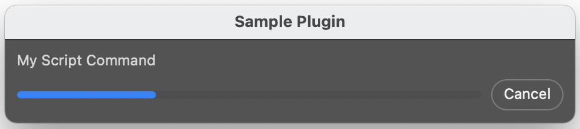
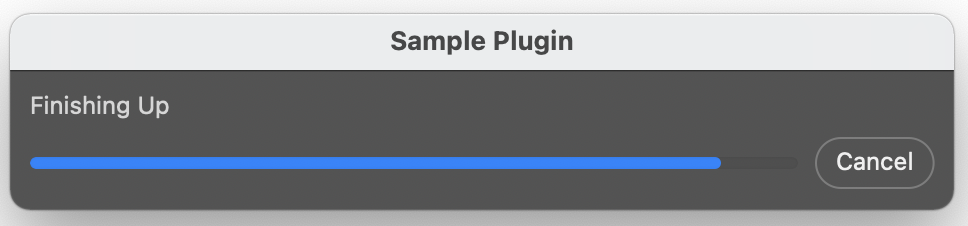
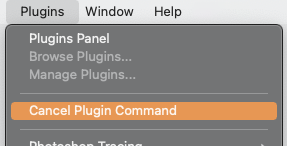

# ExecuteAsModal

ExecuteAsModal is needed when a plugin wants to make modifications to the Photoshop state. This includes scenarios where the plugin creates or modify documents, or the plugin wishes to update UI or preference state.

ExecuteAsModal is only available to a plugin that is using apiVersion 2 or higher.

Only one plugin at a time can use `executeAsModal`, and this means that executeAsModal guarantees that the plugin gets exclusive access to Photoshop.

When executeAsModal is active, then Photoshop enters a modal user interaction state. This means that some menu items are disabled.
If the modal state lasts a significant amount of time (currently more than two seconds), then a progress bar is shown. The progress bar will identify the plugin that is associated with the modal state, and it will include the ability for the user to cancel the interaction. The following illustrates the progress bar that would be created for a plugin called "Sample Plugin". The progress bar is indefinite until the plugin informs Photoshop about its progress.



When a plugin is inside a modal scope, then it controls Photoshop. This means that you no longer need to use options such as `modalBehavior` with `batchPlay`.

<br />

## API

ExecuteAsModal is exposed on the Photoshop core module.

```javascript
require('photoshop').core.executeAsModal(targetFunction, options);
```
targetFunction is a JavaScript function that will be executed after Photoshop enters a modal state. When the targetFunction completes, then Photoshop will exit the modal state. The targetFunction can be asynchronous.

Only one plugin can be modal at any given time. If another plugin is modal when you call executeAsModal, then executeAsModal will raise an error. It is therefore important to handle errors when calling this method.

It is also recommended that JavaScript awaits on the result from executeAsModal. Without an await, JavaScript will proceed to the subsequent lines of code while Photoshop enters a modal state.

A typical use case is:
```javascript
try {
    await require('photoshop').core.executeAsModal(targetFunction, {"commandName": "My Script Command"});
    }
    catch(e) {
      if (e.number == 9) {
          showAlert("executeAsModal was rejected (some other plugin is currently inside a modal scope)");
      }
      else {
        // This case is hit if the targetFunction throws an exception
      }
    }
```

<br />

### Arguments
executeAsModal takes the following arguments:
1. targetFunction: The JavaScript function to execute after Photoshop enters a modal state.
1. options: Options describing the request. The following properties are recognized:
    1. commandName (required): A string describing the command. This string is shown in the progress bar UI.
    1. descriptor (optional): An object with command arguments. See documentation for targetFunction below.
    1. interactive (optional): A boolean to toggle [interactive mode](#interactive-mode). 

The JavaScript target function has the following signature:
```javascript
async function targetFunction(executionContext, descriptor)
```
The executionContext contains functionality related to managing the modal state.

The descriptor contains the values provided to the descriptor property in the options argument to executeAsModal.

The executionContext contains the following properties:
* isCancelled: A boolean that is true if the user has cancelled the modal interaction.
* onCancel: A function property. If JavaScript assigns a function to this property, then this function is executed if the user cancels the modal interaction.
* reportProgress: A function that JavaScript can use to customize the progress bar. See below for details.
* hostControl: An object containing the following properties:
   * suspendHistory. A function that can be used to suspend history on a target document. See below for details.
   * resumeHistory. A function that can be used to resume history on a target document. See below for details.
   * registerAutoCloseDocument. Register a document to be closed when the modal scope exits. See below for details.
* unregisterAutoCloseDocument. Unregister a document from being closed when the modal scope exits. See below for details.

<br />

### User cancellation
executeAsModal puts Photoshop into a modal state, and it is important to allow the user to exit this state if the command was invoked by mistake, or if the command is taking too much time.

The user can cancel the operation by pressing the Escape key or using cancellation UI in the progress bar.
If the user cancels the interaction, then JavaScript should return from its target function as soon as possible.
JavaScript can use `isCancelled` and `onCancel` on the executionContext to get information about the current user cancellation state. In addition to this, Photoshop APIs such as `batchPlay` will raise an exception if they are invoked from a target function after the user has cancelled the interaction.

The following is an example of a target JavaScript function:
```javascript
async function targetFunction(executionContext, descriptor) {
  let target = {_ref:[{_ref:"property", "_property": "hostName"}, {"_ref":"application","_enum":"ordinal","_value":"targetEnum"}]};
  let command = {"_obj": "get", "_target": target};
  while (true) {
    await psAction.batchPlay([command], {});
  }
}
await require("photoshop").core.executeAsModal(targetFunction, {"commandName": "User Cancel Test"});
```
This sample will run until the user cancels the interaction. After the user cancels, the modal scope becomes cancelled, and the next call to batchPlay will raise an exception and exit the target function.

Due to the design of the underlying JavaScript runtime, JavaScript can only be cancelled when it is *interruptible*. JavaScript can be interrupted when it is waiting on the resolution of a promise. Without the "await" keyword in the above example, the JavaScript function would not terminate when the user cancels. Having a tight loop such as the following also does not allow for automatic cancellation of the JavaScript function.
```javascript
async function targetFunction(executionContext) {
  while (true) {
    calculateSomeDigitsOfPi();
  }
}
```
JavaScript that runs for a significant amount of time without an interruption point should regularly query isCancelled on the executionContext. The JavaScript example above can be made cancellable by modifying it to the following:
```javascript
async function targetFunction(executionContext) {
  while (true) {
    calculateSomeDigitsOfPi();
    if (executionContext.isCancelled) {
      throw "user cancelled";
    }
  }
}
```
When the JavaScript function uses "await" with a Photoshop JavaScript command, then it is automatically terminated if the user cancels the operation. The automatic cancellation relies on JavaScript exceptions, and it is therefore important to not discard exceptions. The following function discards exceptions around batchPlay and will therefore *not* be automatically terminated when the user cancels the interaction.
```javascript
async function targetFunction(executionContext) {
  let target = {_ref:[{_ref:"property", "_property": "hostName"}, {"_ref":"application","_enum":"ordinal","_value":"targetEnum"}]};
  let command = {"_obj": "get", "_target": target};
  while (true) {
    try {
       await psAction.batchPlay([command], {});
    } catch (e) {}
  }
}
await require("photoshop").core.executeAsModal(targetFunction, {"commandName": "User Cancel Test"});
```

<br />

### Progress bar
By default, Photoshop shows an indeterminate progress bar while a modal scope is active. The progress bar is shown a few seconds after the modal scope is initiated.
JavaScript can use `reportProgress` to customize this behavior. To obtain a determinate progress bar, JavaScript can specify a value between 0 and 1 when calling reportProgress. Example:
```javascript
async function targetFunction(executionContext) {
  executionContext.reportProgress({"value": 0.3});
}
```
Setting a value will switch the progress bar to be a determinate progress bar & show the progress bar if it is not yet visible.

JavaScript can change the commandName that is shown in the progress UI by using the "commandName" property. This can be used to inform the user about the current stage of the operation. Example:
```javascript
executionContext.reportProgress({"value": 0.9, "commandName": "Finishing Up"});
```


The progress bar is hidden while modal UI is shown.

<br />

### Interactive Mode
*Added in Photoshop 23.3*

If a plugin requires the accepting of user input or interaction while in a executeAsModal scope, "Interactive Mode" may be required.

This mode refrains from displaying a blocking progress dialog to the user, and reduces the number of restrictions that hinder accepting of user input. Use-cases for interactive mode may include:
- allowing users to input data into an invoked modal filter dialog
- awaiting user input on a Photoshop workspace, such as Select and Mask

```javascript
await require("photoshop").core.executeAsModal(targetFunction, {"commandName": "Apply two filters", "interactive": true});
```

In lieu of the progress bar dialog, users can find the `Cancel Plugin Command` menu item under the Photoshop `Plugins` menu. This will interrupt the plugin's executeAsModal scope as described in [User Cancellation](#user-cancellation).



<br />

### History state suspension
The hostControl property on the executionContext can be used to suspend and resume history states. While a history state is suspended, Photoshop will coalesce all document changes into a single history state with a custom name.

Example:
```javascript
async function historyStateSample(executionContext) {
    let hostControl = executionContext.hostControl;

    // Get an ID for a target document
    let documentID = await getTargetDocument();

    // Suspend history state on the target document
    // This will coalesce all changes into a single history state called
    // 'Custom Command'
    let suspensionID = await hostControl.suspendHistory({
        "documentID": documentID,
        "name": "Custom Command"
    });

    // modify the document
    // . . .

    // resume the history state
    await hostControl.resumeHistory(suspensionID);
}
```
The signature for suspendHistory is:
```javascript
executionContext.hostControl.suspendHistory(options)
```
The `options` argument is an object with the following properties:
* `documentID: number`: The ID of the document whose history state should be suspended.
* `name: string`: The name that is used for the history state. This is visible in the History panel.
suspendHistory returns a suspension identifier. This identifier should be used with resumeHistory.

The signature for resumeHistory is:
```javascript
executionContext.hostControl.resumeHistory(suspensionID, commit)
```
* `suspensionID: object`: the suspension identifier object that was returned from `suspendHistory`.
  * To rename the committed history state, assign an optional `finalName: string` to this parameter in order to provide an updated history state naming to be displayed to the user, overriding the original `name` passed in with `suspendHistory`.
* `commit: boolean`: if `true` then the current document state is committed and a history state is created. If `false`, the document state is rolled back to the time when the state was suspended. This argument is optional and the default value is `true`. Photoshop only creates a history state if the document was modified between the calls to `suspendHistory` and `resumeHistory`.

When the modal scope ends, Photoshop will auto-resume history on any document that is still in a suspended state. If the target function for the modal scope returns normally, then all unsuspended states are committed. If the target function exits via an exception, then all unsuspended history states are cancelled.

<br />

### Notifications
When executeAsModal is active, then Photoshop notifications are silenced similar to when an action is run from the actions panel.

This means that other plugins cannot listen for batchPlay commands that are executed while the modal scope is active.

Plugins can register for notifications related to starting and ending a modal JavaScript scope by registering for the following events:
* "modalJavaScriptScopeEnter"
* "modalJavaScriptScopeExit"

<br />

### Automatic document closing
When the user cancels a modal scope, then JavaScript cannot make any further document changes until it returns from the modal scope. In order to ensure proper clean up of temporary documents, JavaScript can register one or more documents to be automatically closed without saving when the modal scope ends. The following is an example of JavaScript that registers a document to be closed when the modal scope ends:
```javascript
async function modalFunction(executionContext) {
    let hostControl = executionContext.hostControl;

    let docID = await createDocument();
    await hostControl.registerAutoCloseDocument(docID);

    ...
}
```
JavaScript can unregister a document from being automatically closed by using unregisterAutoCloseDocument. The following illustrates JavaScript that creates and marks a document as "auto close" while the method is running. If the method succeeds then the document is unregistered from the set of auto close documents. This allows JavaScript to create a complete document, or close the document is the user cancels while the script is running.
```javascript
async function modalFunction(executionContext) {
    let hostControl = executionContext.hostControl;

    let docID = await createDocument();
    await hostControl.registerAutoCloseDocument(docID);

    // Add contents to docID

    ...

    await hostControl.unregisterAutoCloseDocument(docID);
}
```

<br />

### Notes
You can have nested modal scopes. A target function can use executeAsModal to execute another target function.
All modal scopes share the same global modal state. This mean that any nested scope can modify the state on the (single) progress bar. Similarly, you can suspend the history state of a document in one scope, and resume the state in another.
