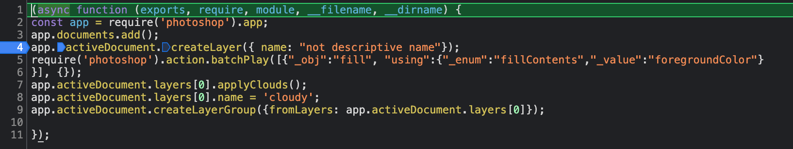

# UXP Scripting in Photoshop

Running a standalone JavaScript file in UXP is now available in Photoshop.  As discussed in the [general documention of UXP Scripting](http://developer.adobe.com/photoshop/uxp/2022/scripting/), Photoshop recognizes the new file extension .psjs for JavaScript files that will be executed by UXP.


## Running a file
To run a script file, you have multiple options.
- Select the file via the dialog from the menu File > Scripts > Browse...
- Drag-and-drop the file onto the Ps icon in the Dock (Mac) or application frame (Mac and Win).
- Play an Action that executes a script file.
- (_Coming soon_) Double-click via a file type association for .psjs registered at installation.

<br />

## Developing Script files
As described in the [general documentation for UXP Scripting](http://developer.adobe.com/photoshop/uxp/2022/scripting/), script files are executed in a context that is mostly the same as those used in UXP plugins.  The primary task of controlling Photoshop is the same.

Using the [UXP Photoshop DOM API](../../), we can do the following in a script file: [cloudy.psjs](./assets/cloudy.psjs).
  1. Create a new file.
  2. Create a new layer.
  3. Fill with the foreground color.
  4. Rename the layer.
  5. Apply the Clouds filter.
  6. Group the layer.

```javascript

const app = require('photoshop').app;
app.documents.add();
app.activeDocument.createLayer({ name: "not descriptive name"});
require('photoshop').action.batchPlay([{"_obj":"fill", "using":{"_enum":"fillContents","_value":"foregroundColor"}
}], {});
app.activeDocument.layers[0].applyClouds();
app.activeDocument.layers[0].name = 'cloudy';
app.activeDocument.createLayerGroup({fromLayers: app.activeDocument.layers[0]});
```
_Note the empty line at the top, you'll see why in the UDT screenshot._

You may have noticed the use of `batchPlay` to achieve one of the above steps.  We have an [at-length description](./batchplay) of why to help break down the situation.

<br />

## Debugging Script files
Starting with Photoshop 23.5 and [UXP Developer Tool](https://creativecloud.adobe.com/apps/download/uxp-developer-tools) (UDT) version 1.6.0, you can step through and debug a script.  

Again, the [general documentation for UXP Scripting](http://developer.adobe.com/photoshop/uxp/2022/scripting/), walked through using the UDT.  Here, we'll just show what the above script looks like loaded into UDT with a breakpoint activated.  From here you set breakpoints or Step Into the script files.  (That empty first line mentioned previously accomodates the wrapping that is applied to script file contents.)




Sharp-eyed readers will notice similarities between the properties under `require('uxp').script` and [those present for `executeAsModal`](./executeasmodal/#arguments).  Scripts are executed in a similar context.  The shared properties and methods of both will converge in the future with a shared understanding and usage patterns.  This documentation will be updated when they are ready for use.

