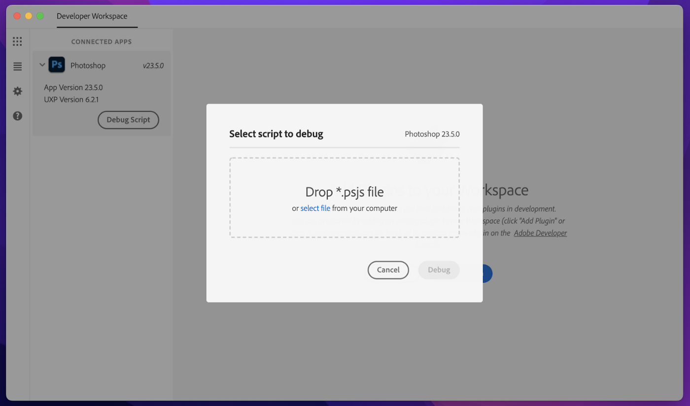

# Quickstart Guide

## Creating your first script
1. To get started, create a file and save it with a `.psjs` extension onto your computer. Example filename: `hello-world.psjs`
2. Add the following code to that file:

```js
require('photoshop').core.showAlert('Hello world!')
```

## Run your script 
There are a few different entrypoints from which you can trigger a script. 
1. Select the script to be executed from: "File Menu > Scripts > Browse"
2. Drag and drop a .psjs file onto the Photoshop icon in Dock for Mac. For Mac and Windows, script files can be dropped onto any part of the Photoshop window that is not an open document.

## Debug your script 
You can debug Photoshop scripts using the [UXP Developer Tools](https://creativecloud.adobe.com/apps/download/uxp-developer-tools) (UDT) application. If you don’t already have this application installed, you can download it from the Creative Cloud desktop application. Developers can debug scripts from UDT 1.6 onwards.

Launch the UDT app. Once you have Photoshop running, you should be able to see it under “Connected Applications”. 

You should see a new “Debug Script” button inside the “Connected Applications” card. Click the button to select the script file and debug in the UDT app.


