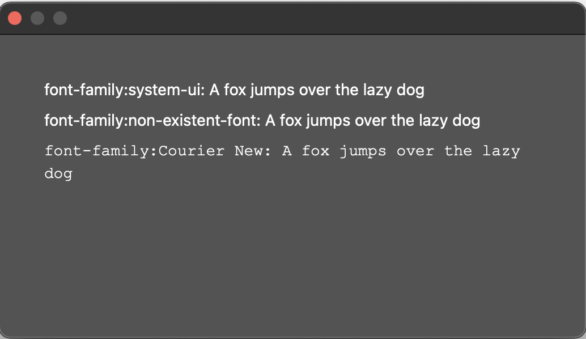

# Samples

## Create a new layer 
You can create a script that creates a new layer, with the help of the Photoshop DOM API: 
```js
const app = require('photoshop').app;
await app.documents.add();
await app.activeDocument.createLayer();
app.activeDocument.layers[0].name = 'New layer';
```

## Access the local filesystem
You can create a script that accesses your local filesystem, with the help of the UXP storage module: 
```js
const uxpfs = require("uxp").storage;
const ufs = uxpfs.localFileSystem;

try {
    const folder = await ufs.getTemporaryFolder()
    const metadata = await folder.getMetadata();
    console.log(JSON.stringify(metadata));
} catch (e) {
    console.log(`Local File system error: ${e}`);
}
```

## Using a file picker
You can create a script that instantiates a file picker for writing/saving to files.
```js
const fs = require('uxp').storage.localFileSystem;
try {
    // save file to a location using file picker
    const file = await fs.getFileForSaving("demo.txt");
    await file.write("Hello World! This is demo.");
} catch (e) {
    console.log(e);
}
```

## Read/write to clipboard
You can access the clipboard module (`navigator.clipboard`) to: 
* write to a clipboard (`setContent()`)
* read a clipboard's contents (`readText()`)
```js
try {
    const clipboard = navigator.clipboard;
    await clipboard.setContent({ 'text/plain': "Test string" });
} catch (e) {
    throw new Error(e);
}
try {
    const clipboard = navigator.clipboard;
    const text = await clipboard.readText();
    console.log(text);
}  catch (e) {
    throw new Error(e);
}
```

## Create dialog UIs
### Simple example
```js
async function createDialog() {
    const dialog = document.createElement("dialog");
    dialog.style.color = "white";
    const div = document.createElement("div");
    div.style.display = "block";
    div.style.height = "200px";
    div.style.width = "400px";
    const header = document.createElement("h2");
    header.id = "head";
    header.style.color = "white";
    header.textContent = "Sample Dialog";
    div.appendChild(header);
    dialog.appendChild(div);
    await document.body.appendChild(dialog).showModal();
}
// Wait for the dialog to render
await createDialog();
```

### Example with "Done" button
```js
async function showDialog() {
    let dialog = createDialog();
    document.body.appendChild(dialog).showModal();

    // Give the script time to show the dialog by returning a promise. Make sure that it is resolved/rejected later.
    return new Promise((resolve, reject) => {
        try {
            // Resolve the promise and dismiss the dialog when when user clicks on 'Done' button
            const doneBtn = document.getElementById("done");
            doneBtn.addEventListener("click", () => {
                console.log("user is done");
                dialog.close();
                resolve("user is done");
            })

            // reject when dialog is cancelled/closed
            dialog.addEventListener("cancel", () => {
                console.log("dialog cancelled");
                reject("dialog cancelled");
            });

            dialog.addEventListener("close", () => {
                console.log("dialog closed");
                reject("dialog closed");
            });
        } catch (e) {
            console.log(e);
            reject(e);
        }
    })
}

function createDialog() {
    const dialog = document.createElement("dialog");
    dialog.style.color = "white";
    const div = document.createElement("div");
    div.style.display = "block";
    div.style.height = "200px";
    div.style.width = "400px";
    const header = document.createElement("h2");
    header.id = "head";
    header.style.color = "white";
    header.textContent = "Sample Dialog";
    div.appendChild(header);
    const doneButton = document.createElement("button");
    doneButton.id = "done";
    doneButton.textContent = "Done";
    div.appendChild(doneButton);
    dialog.appendChild(div);
    return dialog;
}

// Wait for the dialog to render
await showDialog();
```

## Access installed fonts
Photoshop has set the permission for the Fonts module to `ReadInstalled`. This means that if no font is specified or if the font is not installed, then UXP will fallback to "system-ui" font (the default OS system UI font).

```js
async function createDialog() {
    const dialog = document.createElement("dialog");

    dialog.style.color = "white";

    const div = document.createElement("div");
    div.style.display = "block";
    div.style.height = "200px";
    div.style.width = "450px";

    const p1 = createParagraph("system-ui"); // use default OS font
    const p2 = createParagraph("non-existent-font"); // try using a non existent font. Will resolve to OS default.
    const p3 = createParagraph("Courier New"); // use any installed font
    div.appendChild(p1);
    div.appendChild(p2);
    div.appendChild(p3);

    dialog.appendChild(div);
    await document.body.appendChild(dialog).showModal();
}

function createParagraph(fontFamily) {
    const p = document.createElement("p");
    p.style.color = "white";
    p.style.fontFamily = fontFamily;
    p.textContent = `font-family:${fontFamily}: A fox jumps over the lazy dog`;
    return p;
}

// Wait for the dialog to render
await createDialog();
```
