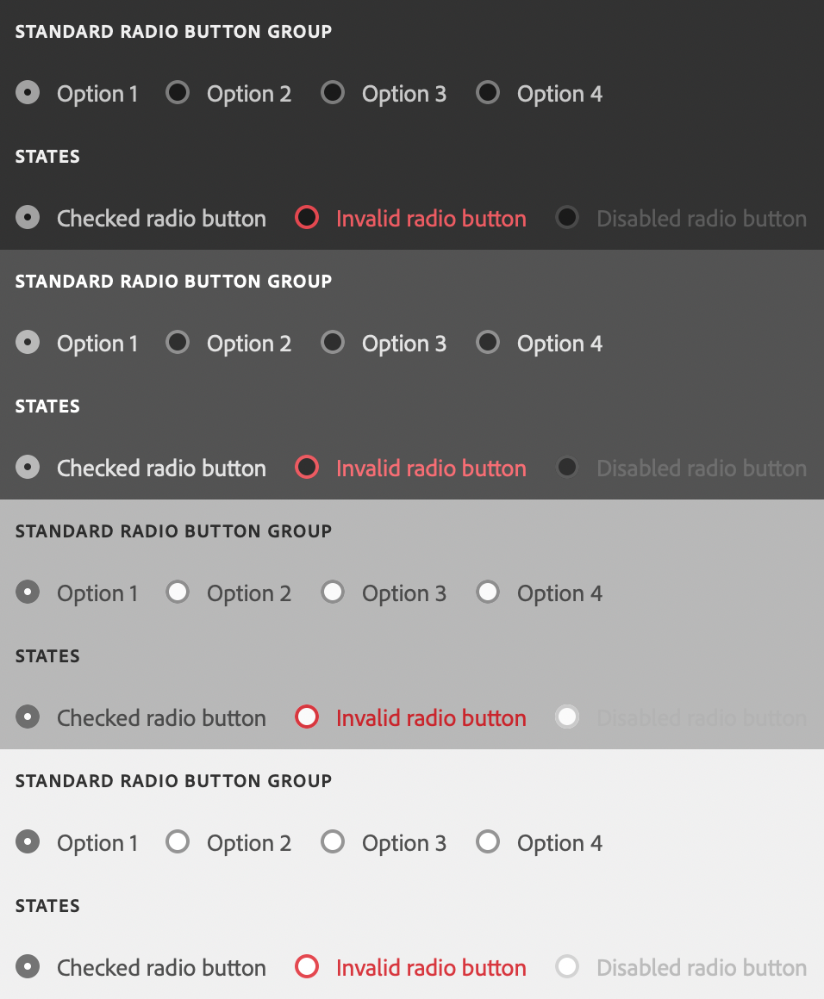

# sp-radio

**Since:** UXP v4.1

Renders a radio button with associated label.



**See**:
- [https://spectrum.adobe.com/page/radio-button/](https://spectrum.adobe.com/page/radio-button/)
- [https://opensource.adobe.com/spectrum-web-components/components/radio/](https://opensource.adobe.com/spectrum-web-components/components/radio/)

**Example**

```html
<sp-radio value="ps">Adobe Photoshop</sp-radio>
```

## Variants and states

There are several different variants and states for radio buttons.

### Checked

Indicates that the radio button is selected.

```html
<sp-radio checked value="ps">Adobe Photoshop</sp-radio>
```

### Disabled

Indicates that the radio button is disabled.

```html
<sp-radio disabled value="ps">Adobe Photoshop</sp-radio>
```

### Invalid

Indicates that the radio button selection is invalid.

```html
<sp-radio invalid value="ps">Adobe Photoshop</sp-radio>
```

### Emphasized

Indicates that the radio button selection is emphasized.

```html
<sp-radio emphasized value="ps">Adobe Photoshop</sp-radio>
```

## Responding to events

You can respond to clicks on the radio button using the `click` event.

```js
document.querySelector(".yourRadioButton").addEventListener("click", evt => {
    console.log(`You clicked: ${evt.target.value}`);
})
```

